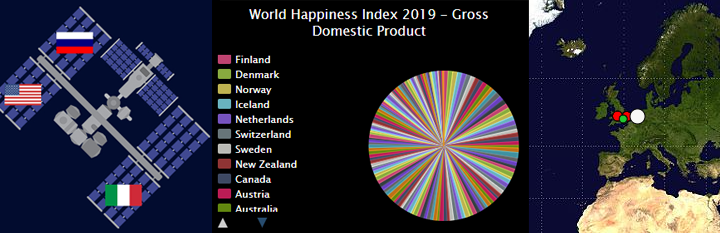

## Your idea

Use this step to plan your data visualisation. You can plan by just thinking, tinkering, drawing or writing, or however you like!

### Why are you making your data visualisation?

--- task ---

Think about the **purpose** of the data visualisation you are creating. There are **eight** datasets to choose from as starter projects **or** you can find your own data set on a topic that you would like to highlight to others. 

A good place to explore data sets is [Kaggle](https://www.kaggle.com/datasets){:target="_blank"}. 

The purpose of your data visualisation could be to:

+ show the different expeditions that have taken place on the ISS.
+ demonstrate the most intelligent dog breeds. 
+ classify the different types of UFO sightings and where they are mostly located.
+ show areas around the world that experience maritime piracy events.
+ discover the areas around the world that are the best places to live (according to the happiness index)
+ show the most powerful pokemon characters.
+ analyse locations that experience the highest levels of shark attacks. 
+ find out the movies that have the best Bechdel Test scores (this is a data set that looks into how women are represented in movies)  
+ highlight a topic or hobby that is important to you.

**Tip:** Data visualisations are used quite regularly in news articles as an accessible way to show readers the relevant data related to the article. For example, there might be a map that shows traffic hotspots in your area or the local weather for certain locations. You could spend some time looking at news websites to see if you can get some inspiration there. 

**Another tip:** If you are going to use your own data set and want to place shapes on a world map then you will need to have data that contains the **longitude** and **latitude** locations for the items that you wish to display. 

--- /task ---

--- save ---
