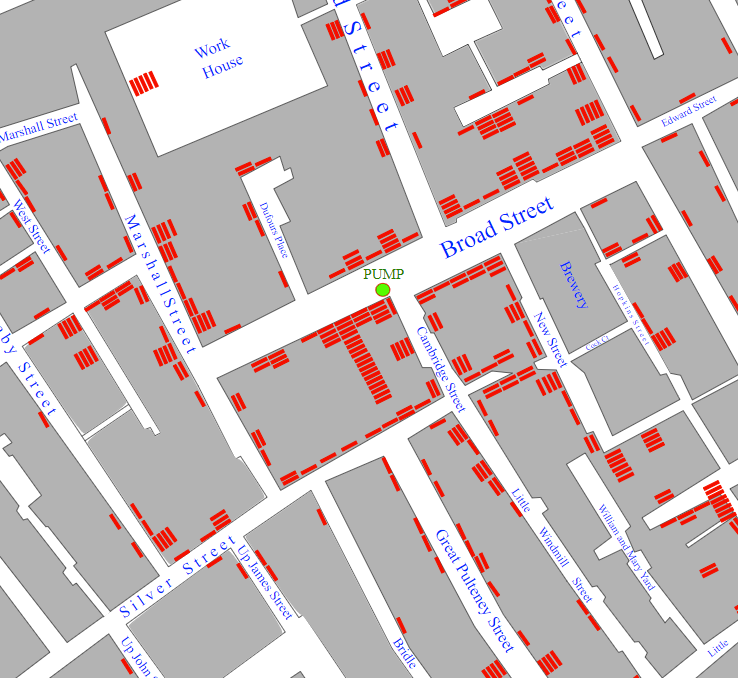

## Your idea

Use this step to plan your data visualisation. You can plan by just thinking, tinkering, drawing or writing, or however you like!

### Why are you making your data visualisation?

--- task ---

Think about the **purpose** of the data visualisation you are creating. There are **eight** datasets to choose from as starter projects **or** you can find your own data set on a topic that you would like to highlight to others. 

A good place to explore other data sets is [Kaggle](https://www.kaggle.com/datasets){:target="_blank"}. 

The **purpose** of your data visualisation could be to:

+ Show the different **expeditions** that have taken place on the **ISS**
+ Demonstrate the **most intelligent dog** breeds 
+ Classify the different types of **UFO sightings** and where they are mostly located
+ Show areas around the world that have experienced **volcano eruptions**
+ Discover the areas around the world that are the **best places to live** (according to the happiness index)
+ Show the most powerful **pokemon** characters
+ Analyse the **caffeine** levels in popular drinks 
+ Find out the **movies** that have the best **Bechdel Test scores** (this is a data set that looks into how women are represented in movies)  
+ Highlight a topic or hobby that is **important** to you

**Tip:** Data visualisations are used quite regularly in news articles as an accessible way to show readers the relevant data related to the article. For example, there might be a map that shows traffic hotspots in your area or the local weather for certain locations. You could spend some time looking at news websites to see if you can get some inspiration there. 

**Another tip:** If you are going to use your own data set and want to place shapes on a world map then you will need to have data that contains the **longitude** and **latitude** locations for the items that you wish to display. 

--- /task ---

In 1854, the physician John Snow believed that the the outbreak of cholera in the Soho area of London was being caused by a contaminated water supply — contrary to the commonly held belief that cholera was caused by 'bad air' in the area. To help prove his theory, Snow mapped the deaths from cholera in the area. The map clearly showed the deaths were centred around Broad Street and residents there were getting their water from the pump on this street. By visualising the data in this way, he was able to convince the local council to disable the water pump. It was widely recognised that this visualisation helped to save many lives.

{:width="200px"}

### Who is it for?

--- task ---

Think about who you will make your data visualisation for (your **audience**).

What is the **significance** of your visualisation? Does it highlight something specific about the world around us?

Will the colours, shapes, images, or charts mean **something special** to you or your audience?

Sharing your data visualisation is a great way to express something about yourself, your interests, or your culture.

--- /task ---

### Get started

--- task ---

Select the correct **starter project** for your chosen data visualisation. Trinket will open in a new window. Select **remix** to create your own copy of the project.

The **ISS expedition** [starter project](https://trinket.io/python/21eb7fb833){:target="_blank"}.

The **Volcano Eruptions** [starter project](https://trinket.io/python/62af00db94){:target="_blank"}.

The **UFO tracker** [starter project](https://trinket.io/python/3ea4e1440c){:target="_blank"}.

The **World happiness index** [starter project](https://trinket.io/python/d9f19977c1){:target="_blank"}.

The **Dog breed characteristics** [starter project](https://trinket.io/python/e0b08a10f4){:target="_blank"}.

The **Caffeinated drinks** [starter project](https://trinket.io/python/0f11ace963){:target="_blank"}.

The **Bechdel Test Scores** [starter project](https://trinket.io/python/2affa12e55){:target="_blank"}.

The **Pokemon card data** [starter project](https://trinket.io/python/002f48dc17){:target="_blank"}.

**Using your own data set**

If you are using your own data set then you will need to use the blank [starter project](https://trinket.io/python/9834b55047){:target="_blank"}. You will also need to **add** in your own data set. 

--- collapse ---
---
title: Add your own data set
---

Once you have found your own data set you will need to **download** it as a CSV file. 

You should then **open** the file and check it for missing or unusual data.

**Tip 1:** It is a good idea to delete a **whole row** of data if it has sections that are blank. This will help to prevent problems with your code later on. 

**Tip 2:** Look carefully at the data in your CSV file. Can you see any unusual symbols where text should be? If so, you might want to also delete these rows. Another option is to delete the symbols as long as that doesn't change the meaning of the data. 

**Tip 3:** If your data has lots of extra columns that you aren't going to use for your visualisation then it is a good idea to delete them. This will make it easier to navigate and access your data from your code. 

Once you are satisfied that your data is looking good, it is time to upload it. Here's how:

1. Make sure that you have saved your CSV file as a CSV file. If you have been editing it in spreadsheet software then you might have to change the file type to CSV **before** pressing save.
2. Find the location of your CSV file. It will most likely be in your downloads folder if you downloaded it from a site like Kaggle.
3. Open the file with notepad (right-click on the file and choose **Open with** > **Notepad**).
4. Delete the header (top) row of data as you will not need this for your program.
5. Scroll to the bottom of your file and check that there isn't a blank space at the bottom. If there is, delete it.
6. Go to **File** > **Save As** and save the file as `your-file-name.txt`. You **must** put `.txt` at the end of the file name. 
7. Go to your starter project in Trinket.
8. Click on the icon next to the image upload icon, it has a little up arrow on it.

9. Find your text file, select it and click on **Open**. 

**Note:** Your file has the extension `txt`. You can keep it as `txt` and it will work in exactly the same way as the other CSV files that you have used. 

If you wish to change it to `.csv` then you can click the settings icon to the right of the file name and chose the edit button. 

--- /collapse ---

--- /task ---

### Set up your project

--- task ---

### Add in your import statements

--- collapse ---
---
title: Using p5 to draw shapes
---

If you are going to be drawing shapes using `p5` then you will need to include the import statement at the top of your code:

--- code ---
---
language: python
filename: main.py
line_numbers: true
line_number_start: 1
line_highlights: 
---
from p5 import *

--- /code ---

The import statement imports **all** of the code from the `p5.py` file that is also in your Trinket window.

--- /collapse ---

--- collapse ---
---
title: Convert longitude and latitude data to xy coordinates
---

If your CSV file includes longitude and latitude data, then you can use this to place objects on a world map. The file `xy.py` has been created to allow you to convert the latitude and longitude data to xy coordinates that can be used in your program. 

To use the `xy.py` file, you will need the following import statement at the top of your code:

--- code ---
---
language: python
filename: main.py
line_numbers: true
line_number_start: 1
line_highlights: 
---
from xy import get_xy_coords

--- /code ---

--- /collapse ---

--- collapse ---
---
title: Using pygal to create charts
---

If your project requires you to create graphs and charts then you will need to use **pygal**. The following line of code imports **pygal** into your program:

--- code ---
---
language: python
filename: main.py
line_numbers: true
line_number_start: 1
line_highlights: 
---
from pygal import *
--- /code ---

--- /collapse ---

### Additional setup code

--- collapse ---
---
title: Setup code for drawing with p5
---
If you are going to be drawing using `p5` then you will need to create two functions and to include the `run()` function call. 

**Function one**

--- code ---
---
language: python
filename: main.py - setup()
line_numbers: true
line_number_start: 
line_highlights: 
---
def setup():

--- /code ---

This is the setup code for the drawing and will run only once. This is where you decide the size of your canvas and load any images that you need, including a background image (if required). This is also where you will load the data from your CSV file. 

**Function two**

--- code ---
---
language: python
filename: main.py - draw()
line_numbers: true
line_number_start: 
line_highlights: 
---
def draw():

--- /code ---

This is the code for the drawing and will run repeatedly. This is where you build the image that will appear on the screen. It could place images of astronauts onto a background or place data points on a map. 

**The `run()` function call**

This should be the last line of code in your program. This starts the drawing process. It first calls the `setup()` function, then it repeatedly runs the `draw()` function. 

--- /collapse ---

--- /task ---

--- task ---

**Test:** Here are some things that you should check before moving on to the next step:

+ If your project has a background image, does it load?
+ Does your CSV file contain any blanks, errors, or extra line spaces at the bottom? If so, you will need to remove them.

--- /task ---

--- save ---
