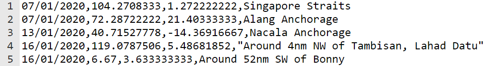

## Build and test – Draw or chart

Now it's time to make your data visualisation project.


In order to be successful with a programming project, you need to use **decomposition** skills to break the problem down into smaller, more manageable parts. This means you should take each part at a time and get it working before moving on to the next part. 

**Tip:** Test your code after each new section to make it easier to find and fix new errors. 

--- collapse ---
---
title: Example decomposition
---

Does your idea require a drawing to appear on the screen based on data in a text file? If so, you can break this problem down in the following way:

1. Write the code for drawing a shape or loading an image
2. Make the image appear in the centre of the screen to test it
3. Load the required data from the text file
4. `print()` the data that you need for the image location to check that the code works
5. Use the data to place the image in the correct location

--- /collapse ---

Think about the steps that you will need to take in order to be successful in your project. Will you need to display a chart or an image? What skills will you need to make that happen?

--- task ---

You have built up some really useful skills. Here is a reminder to help you make your data visualisation:

### Shapes and images

[[[p5-coordinates]]]

[[[processing-add-image]]]

[[[processing-python-ellipse]]]

[[[processing-python-rect]]]

[[[processing-python-triangle]]]

[[[processing-python-quad]]]

--- collapse ---

---
title: Use emoji characters
---

You can use emoji characters in the p5 text() function to use an emoji to represent your player.

Here’s an example:

--- code ---
---
language: python
filename: main.py
line_numbers: 
line_number_start: 
line_highlights: 
---
def setup():
  size(400, 400)
  text_align(CENTER, TOP) #Position around the centre

def draw_emoji(emoji, size): #snake
  text_size(size) #Controls the size of the emoji
  text(emoji, 200, 200)
  
--- /code ---

--- /collapse ---

[[[processing-translation]]]

[[[processing-rotation]]]


--- collapse ---
---
title: Placing a shape according to latitude and longitude
---

The `xy.py` file is available in all of the starter projects. This file will take the **longitude** and **latitude** data from your **CSV** file and return the coordinates for a shape to be placed on an image. 

The example code below shows the `longitude` and `latitude` data being accessed from the dictionary. It then passes this data as arguments into the `get_xy_coords` function which then returns the coordinates.  

--- code ---
---
language: python
filename: 
line_numbers: false
line_number_start: 1
line_highlights: 10-12
---
def draw_data():
  
  no_stroke()
  
  # Use the lat and long data to calculate the x y coords for the shape
  
  i = 255
  
  for eruption in volcano_eruptions:
    longitude = float(eruption['longitude'])
    latitude = float(eruption['latitude'])
    region_coords = get_xy_coords(longitude, latitude) # return coordinates to place map pin
    region_x = region_coords['x']
    region_y = region_coords['y']
    colour = color(i, 255, 255)
    colours[colour] = eruption
    draw_volcano(colour, region_x, region_y)
    i -= 2
--- /code ---

--- /collapse ---

### Colours and effects

[[[generic-theory-simple-colours]]]

--- collapse ---

---
title: Colour in p5
---

The p5 color() function expects three numbers: one each for red, green, and blue.

--- code ---
---
language: python
filename: main.py
line_numbers: false
line_number_start: 1
line_highlights: 1
---
blue = color(50, 70, 206) #Red = 50, Green = 70, Blue = 206

--- /code ---

--- /collapse ---

[[[processing-opacity]]]

[[[processing-stroke]]]

[[[processing-tint]]]

--- collapse ---
---
title: Change the value of one map pin colour
---
This example changes the value for red each time the code places a pin:

**Remember** to also define a `colours` dictionary in the main part of your code, typically near the top. 

--- code ---
---
language: python
filename: 
line_numbers: false
line_number_start: 
line_highlights: 1, 9, 17-20
---
colours = {}

def draw_data():
  
  no_stroke()
  
  # Use the lat and long data to calculate the x y coords for the shape
  
  red = 255
  
  for eruption in volcano_eruptions:
    longitude = float(eruption['longitude'])
    latitude = float(eruption['latitude'])
    region_coords = get_xy_coords(longitude, latitude)
    region_x = region_coords['x']
    region_y = region_coords['y']
    colour = color(red, 255, 255)
    colours[colour] = eruption
    draw_volcano(colour, region_x, region_y)
    red -= 2
--- /code ---


--- /collapse ---

--- collapse ---
---
title: Change the value of multiple map pin colours
---


--- /collapse ---

--- collapse ---
---
title: Choose random colours for your map pins
---


--- /collapse ---

<mark> Add a collapse here for using random and seed to generate different colours for the pins. The colours need storing in a dictionary as keys, mapped to the data to be retrieved, as in mapping-data</mark>

--- collapse ---
---
title: Set the background colours when your program starts
---

Define a new function called `draw_background()` and create a call to it in `draw():`, after a call to `no_stroke()`. 

--- code ---
---
language: python
filename: main.py - draw_background()
line_numbers: false
line_number_start: 1
line_highlights: 1-4
---
def draw_background(colour):
  # Background colour
  fill(colour)
  rect(0, 0, 400, 400)

--- /code ---

Then create a call to it in `draw()`:

--- code ---
---
language: python
filename: main.py - draw()
line_numbers: false
line_number_start: 1
line_highlights: 8
---
def draw():

  red = color(255,0,0)
  green = color(0,255,0)
  blue = color(0,0,255)

  no_stroke()
  draw_background(red)

--- /code ---

If you want your background to include more colours, you will need to add more parameters.

--- code ---
---
language: python
filename: main.py - draw_background()
line_numbers: false
line_number_start: 1
line_highlights: 1, 6-7
---
def draw_background(green, blue):
  
  # Background colour
  fill(blue)
  rect(0, 0, 400, 200)
  fill(green)
  rect(0, 200, 400, 200)

--- /code ---

Then create a call to it in `draw()`:

--- code ---
---
language: python
filename: main.py - draw()
line_numbers: false
line_number_start: 1
line_highlights: 7-8
---
def draw():

  red = color(255, 0, 0)
  green = color(0, 255, 0)
  blue = color(0, 0, 255)

  no_stroke()
  draw_background(green, blue)

--- /code ---

--- /collapse ---

### Load data from text files

--- collapse ---
---
title: Load data into a variable
---

To write the **entire contents** of a text file into a **variable**, you can use the following code:

--- code ---
---
language: python
filename: main.py
line_numbers: false
line_number_start: 
line_highlights: 
---
my_text_file = '' # Initialises the variable so that it can be added to

with open('filename.csv') as f: # Opens the file temporarily
  for line in f: # Loops through each line in the file
      my_text_file += line # Adds the line to the current contents of the variable
--- /code ---

This can be a useful code snippet if you are working with very small text files and you don't intend to perform many actions on the loaded data. For example, you might want to just display the contents of the text file. 

--- /collapse ---

--- collapse ---
---
title: Load data into a single list
---
To write **each line** of a text file as a separate **item** in a list, you can use the following code:

--- code ---
---
language: python
filename: main.py
line_numbers: false
line_number_start: 
line_highlights: 
---
my_text_file = [] # Initialises the list so that data can be appended (added) to it

with open('filename.csv') as f: # Opens the file temporarily
  for line in f: # Loops through each line in the file
      my_text_file.append(line) # Adds each line as an item in the list
--- /code ---

This can be useful if your text file only contains **one** piece of data on **each line**. For example, it might by a list of player names for a game. 

--- /collapse --- 

--- collapse ---
---
title: Load data into a list of lists (a 2D list)
---
A list of lists is often called a 2D list. When data is stored in a CSV file, each item in a line (row) is separated by a comma `,`. 



You can use this comma to create a list of the items for each line. A code snippet for this can be seen below at **line 5**:

--- code ---
---
language: python
filename: main.py
line_numbers: true
line_number_start: 1
line_highlights: 5
---
my_text_file = []

with open('filename.csv') as f:
  for line in f:
      info = line.split(',') # Split each item separated by a comma into a list

print(info)

--- /code ---

If you run the code above then it will output **the last line** of the CSV file as a list. This is because, for each line, the `info` list has been recreated. It hasn't been added to.

```
['29/12/2020', '6.4', '2.733333333', 'Around 94nm South of Brass\n']
```

To store **all** of the data, you can create a **list of lists**!

The code below uses the same code as above but now it **appends** the `info` list to the `my_text_file` list on **line 6**. This means that you can now store all of the data from the CSV file. 

--- code ---
---
language: python
filename: main.py
line_numbers: true
line_number_start: 1
line_highlights: 6
---
my_text_file = []

with open('filename.csv') as f:
  for line in f:
      info = line.split(',')
      my_text_file.append(info) # Add the info list to the my_text_file list

print(my_text_file)

--- /code ---

2D lists are really useful for storing and iterating through large amounts of data. However, you need to be very aware of **what** is being stored and **where** it is being stored. 

--- /collapse ---

--- collapse ---
---
title: Load data into a list of dictionaries
---
Each line (row) from a CSV file can be stored in a **dictionary**. The CSV file below contains data on volcanic eruptions that have taken place since 2010. Each line is a new eruption. Each eruption has the date, longitude, latitude, and location information, as well as other things. 


If this data was stored in a 2D list, then you would need to know the `index` values for the data in order to access it. With a **dictionary**, you just need to know the `key`. This is the keyword used to represent the data held for each event. In this example, the keys are `date`, `longitude`, `latitude`, and `location`.

The code below shows a **list of dictionaries** being created for the contents of a CSV file:

--- code ---
---
language: python
filename: main.py
line_numbers: false
line_number_start: 1
line_highlights: 
---
  volcano_eruptions = [] # Initialise the list to store the eruptions
  
  with open(file_name) as f:
    for line in f:
      info = line.split(',') # Split the line into a list
      volcano_dict = { # Create a dictionary for the event
        'date': info[0],
        'longitude': info[1],
        'latitude': info[2],
        'location': info[3]
      }
      volcano_eruptions.append(volcano_dict) # Store dictionary in a list

--- /code ---

--- /collapse ---

--- collapse ---
---
title: Remove the \n
---
When you look at a text file in its raw form, there is no `\n` at the end of each line. However, when you load each line from a text file you will see that a `\n` appears. This is because `\n` means **add a new line**. Without this, all of the lines of text would be on one, very long line. 

This isn't helpful when you want to use the data in your program. 

To remove the `\n` you can use the `strip()` method. This strips whatever you write in the brackets from the data. 

You can see an example of this being used on **line 3** below:

--- code ---
---
language: python
filename: main.py
line_numbers: true
line_number_start: 1
line_highlights: 3
---
  with open(file_name) as f:
    for line in f: # For each line in the text file
      info = line.strip('\n') # Strip away the \n
      info = info.split(',')

--- /code ---


--- /collapse ---


### Access data from lists and dictionaries

[[[generic-python-list-index]]]

--- collapse ---
---
title: Access data from a dictionary
---

A dictionary has been created to store UFO sightings:

--- code ---
---
language: python
filename: main.py
line_numbers: true
line_number_start: 
line_highlights: 
---
ufo_dict = {
  'date': '12-1-2020',
  'time': '13:55',
  'state': 'TX',
  'country': 'United States of America'
  }

--- /code ---

Data is stored in a dictionary using a **key**, which is the label or keyword for the data. 

The **keys** in this dictionary are:
+ Date
+ Time
+ State
+ Country

If you wanted to find out the **date** for the UFO sighting then you would use this snippet of code:

--- code ---
---
language: python
filename: main.py
line_numbers: false
line_number_start: 
line_highlights: 
---
ufo_dict['date']

--- /code ---

--- /collapse ---

--- collapse ---
---
title: Access data from a list of dictionaries
---

When you create a list of dictionaries, you can loop through the list to find and use the data that you need.

### Example one – ISS expeditions

Here is some example code that was used to find the date of an expedition to the ISS:

--- code ---
---
language: python
filename: main.py
line_numbers: true
line_number_start: 1
line_highlights: 
---
for expedition in expeditions: # Loop through all of the expedition dictionaries in the expeditions list

  if expedition['expedition number'] == 3: # Check if the expedition number is equal to 3
    date = expedition['mission launch date'] # If true, store the matching mission launch date
  
--- /code ---

Notice how the code `expedition['expedition number']` was used to access the data in the dictionary. 

`expedition` is used as a temporary placeholder to loop through the list. At each iteration, `expedition` holds the **current** expedition dictionary. The **key** is then named in the square brackets to access the data. 

### Example two – UFO sightings

Here is another example that was used to find the latitude and longitude values for UFO sightings. 

--- code ---
---
language: python
filename: main.py
line_numbers: true
line_number_start: 1
line_highlights: 
---
for sighting in ufo_sightings: # Loop through all of the sighting dictionaries in the ufo_sightings list

    longitude = float(sighting['longitude']) # Store the longitude data
    latitude = float(sighting['latitude']) # Store the latitude data
--- /code ---

You can see the same pattern occurring with this example as you saw with example one. The loop iterates through the list of dictionaries. For each loop, `sighting` is used as a temporary placeholder for the dictionary. The **key** is then used to access the required latitude and longitude data. 

In this case, `float()` was also used because the data needed to be stored as a decimal number. 

--- /collapse ---

### Displaying charts

[[[pygal-library]]]

--- /task ---

--- task ---

**Test:** Show someone else your project and get their feedback. 
+ If you are creating charts, are you happy with the type of chart that you have displayed and the data that you have used? 
+ If you are adding drawings on a map, are you happy with the shapes that you have chosen? 
+ If you are creating another type of visualisation, could it be improved in any way?

--- /task ---

--- task ---

**Debug:** You might find some bugs in your project that you need to fix. Here are some common bugs.

--- collapse ---
---
title: It keeps saying 'index out of range'
---

The `index out of range` error message typically refers to your code trying to access an **item** in a **list** that doesn't exist. 

If your list is linked to a text file:
+ Check that your text file doesn't have a blank line at the bottom of it
+ Check that the rows in your text file all have the same amount of items (this isn't always needed but in this case, it might be causing a problem)

--- /collapse ---

--- collapse ---
---
title: The data isn't plotting on my map as expected
---

A file has been created to support you with this called `xy.py`. It is an additional file within the starter projects where **latitude** and **longitude** data has been included in the CSV file. 

The code for this file can be seen below:

--- code ---
---
language: python
filename: xy.py
line_numbers: true
line_number_start: 1
line_highlights: 
---
from math import radians, pi, log, tan

def convert_lat_long(latitude, longitude, map_width, map_height):
  
  false_easting = 180
  radius = map_width / (2 * pi)
  latitude = radians(latitude)
  longitude = radians(longitude + false_easting)
  
  x_coord = longitude * radius
  
  y_dist_from_equator = radius * log(tan(pi / 4 + latitude / 2))
  y_coord = map_height / 2 - y_dist_from_equator
  
  coords = {'x': x_coord, 'y': y_coord}
  
  return coords


def get_xy_coords(longitude, latitude, map_width=991, map_height=768):
  
  coords = None
  
  coords = convert_lat_long(latitude, longitude, map_width, map_height)
  return coords

--- /code ---

This code takes **longitude** and **latitude** data, performs some tasks and then returns the x and y coordinates to place the drawing in the correct location. 

If you are using this file:
+ Check that you have imported it at the top of your main program. It should say `from xy import get_xy_coords`.
+ Check that you are passing the **longitude** and **latitude** data in the correct order. Your function call should be similar to this: `get_xy_coords(longitude, latitude)`.
+ Check that the longitude and latitude data has been converted to the **float** data type. Your code should look similar to this: `longitude = float(sighting['longitude'])`.

--- /collapse ---

--- collapse ---
---
title: Something is 'not defined'
---

This is a common error. It usually means that a variable, dictionary, or list is trying to be accessed or modified before it has been defined. 

For example, you might use this code to append an item to a list:

--- code ---
---
language: python
filename: main.py
line_numbers: true
line_number_start: 1
line_highlights: 
---
state = 'TX'

ufo_data.append(state)
--- /code ---

This line of code will cause an error message because the list `ufo_data` has not yet been defined. To fix this error, you would add in a line of code that defines the list. 

--- code ---
---
language: python
filename: main.py
line_numbers: true
line_number_start: 1
line_highlights: 1
---
ufo_data = []

state = 'TX'

ufo_data.append(state)

--- /code ---

--- /collapse ---

--- collapse ---
---
title: My chart isn't displaying
---

Check that you have included the code to display the chart on the screen:

--- code ---
---
language: python
filename: main.py
line_numbers: true
line_number_start: 1
line_highlights: 
---
chart.render()

--- /code ---

You may also need to check that you are converting numerical values to `float()` for decimal numbers or `int()` for whole numbers in your code.  

--- /collapse ---

You might find a bug not listed here. Can you figure out how to fix it?

**Tip:** Find the example project that is most similar to yours and carefully study the code that has been used to make it work. This can help you spot things that you might have missed in your own program. 

We love hearing about your bugs and how you fixed them. Use the feedback button at the bottom of this page if you found a different bug in your project.

--- /task ---


--- save ---
