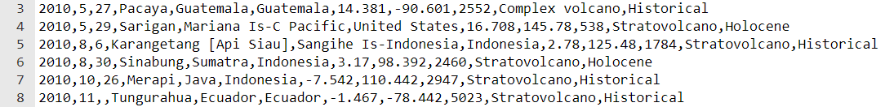

## Build and test

Now it's time to make your data visualisation project.


In order to be successful with a programming project, you need to use **decomposition** skills to break the problem down into smaller, more manageable parts. This means you should take each part at a time and get it working before moving on to the next part. 

**Tip:** Test your code after each new section to make it easier to find and fix new errors. 

--- collapse ---
---
title: Example decomposition
---

Does your idea require a drawing to appear on the screen based on data in a text file? If so, you can break this problem down in the following way:

1. Write the code for drawing a shape or loading an image
2. Make the image appear in the centre of the screen to test it
3. Load the required data from the text file
4. `print()` the data that you need for the image location to check that the code works
5. Use the data to place the image in the correct location

--- /collapse ---

Think about the steps that you will need to take in order to be successful in your project. Will you need to display a chart or an image? What skills will you need to make that happen?


--- task ---

You have built up some really useful skills. Here is a reminder to help you make your data visualisation:

### Shapes and images

[[[processing-python-ellipse]]]

[[[processing-python-rect]]]

[[[processing-python-triangle]]]

[[[processing-add-image]]]

### Colours and effects

[[[generic-theory-simple-colours]]]

[[[processing-opacity]]]

[[[processing-stroke]]]

[[[processing-tint]]]

### Loading data from text files

--- collapse ---
---
title: Load data into a variable
---

To write the **entire contents** of a text file into a **variable**, you can use the following code:

--- code ---
---
language: python
filename: main.py
line_numbers: false
line_number_start: 
line_highlights: 
---
my_text_file = '' # Initialises the variable so that it can be added to

with open('filename.csv') as f: # Opens the file temporarily
  for line in f: # Loops through each line in the file
      my_text_file += line # Adds the line to the current contents of the variable
--- /code ---

This can be a useful code snippet if you are working with very small text files and you don't intend to perform many actions on the loaded data. For example, you might want to just display the contents of the text file. 

--- /collapse ---

--- collapse ---
---
title: Load data into a single list
---
To write **each line** of a text file as a separate **item** in a list, you can use the following code:

--- code ---
---
language: python
filename: main.py
line_numbers: false
line_number_start: 
line_highlights: 
---
my_text_file = [] # Initialises the list so that data can be appended (added) to it

with open('filename.csv') as f: # Opens the file temporarily
  for line in f: # Loops through each line in the file
      my_text_file.append(line) # Adds each line as an item in the list
--- /code ---

This can be useful if your text file only contains **one** piece of data on **each line**. For example, it might by a list of player names for a game. 

--- /collapse --- 

--- collapse ---
---
title: Load data into a list of lists (a 2D list)
---
A list of lists is often called a 2D list. When data is stored in a CSV file, each item in a line (row) is separated by a comma `,`. 



You can use this comma to create a list of the items for each line. A code snippet for this can be seen below at **line 5**:

--- code ---
---
language: python
filename: main.py
line_numbers: true
line_number_start: 1
line_highlights: 5
---
my_text_file = []

with open('filename.csv') as f:
  for line in f:
      info = line.split(',')

print(info)

--- /code ---

If you run the code above then it will output **the last line** of the CSV file as a list. This is because, for each line, the `info` list has been recreated. 

```
['29/12/2020', '6.4', '2.733333333', 'Around 94nm South of Brass\n']
```

In order to store **all** of the data, you can create a **list of lists**!

The code below uses the same code as above but now it **appends** the `info` list to the `my_text_file` list. This means that you can now store all of the data in the CSV file. 

--- code ---
---
language: python
filename: main.py
line_numbers: true
line_number_start: 1
line_highlights: 6
---
my_text_file = []

with open('filename.csv') as f:
  for line in f:
      info = line.split(',')
      my_text_file.append(info)

print(my_text_file)

--- /code ---

--- /collapse ---

--- collapse ---
---
title: Load data into a list of dictionaries
---


--- /collapse ---

--- collapse ---
---
title: How remove the `\n` 
---


--- /collapse ---


### Accessing data from list and dictionaries

--- collapse ---
---
title: Access data from a list
---


--- /collapse ---

--- collapse ---
---
title: Access data from a 2D list
---


--- /collapse ---

--- collapse ---
---
title: Access data from a dictionary
---


--- /collapse ---

--- collapse ---
---
title: Access data from a list of dictionaries
---


--- /collapse ---

--- /task ---


--- save ---
