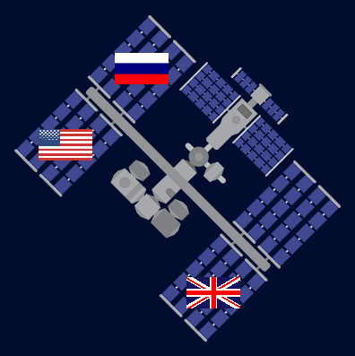

## Build and test

Now it's time to make your data visualisation project.

In order to be successful with a programming project, you need to use **decomposition** skills to break the problem down into smaller, more manageable parts. This means you should take each part at a time and get it working before moving on to the next part. 

**Tip:** Test your code after each new section to make it easier to find and fix new errors. 

--- collapse ---
---
title: Example decomposition
---

Does your idea require a drawing to appear on the screen based on data in a text file? If so, you can break this problem down into the following parts:

1. Write the code for drawing a shape or loading an image
2. Make the image appear in the centre of the screen to test it
3. Load the required data from the text file
4. `print()` the data that you need for the image location to check that the code works
5. Use the data to place the image in the correct location

--- /collapse ---

--- save ---
