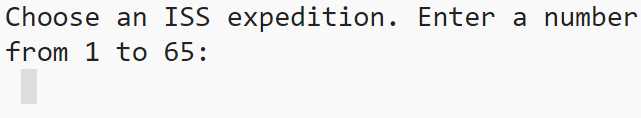

## Expand and test – User interaction

Now it's time to add some user interaction to your data visualisation!



--- task ---

Look at the [**ISS expedition project**](https://trinket.io/python/822033c5b6){:target="_blank"} project. It asks the user to choose an ISS expedition to explore. The user enters a number and then this number is used to:
+ Access the relevant data for that expedition
+ Draw flags on the ISS based on the data
+ Display the relevant expedition data as output for the user

Could your project do something similar?

--- /task ---

--- task ---

Look at the [**UFO tracker**](https://trinket.io/python/cb376de667){:target="_blank"} project. This project allows the user to click on the different shapes that are displayed on the map. When the user clicks on an object, a message is shown to say the **type** of UFO that was spotted in that location. 

Could you use this idea to help you add user interaction to your project?

--- /task ---

--- task ---

Explore the [**Toy dog analysis**](https://trinket.io/python/5d0fbef33b){:target="_blank"} project. This asks the user to choose what type of data is displayed to them in a graph.

Could you give your user options about the type of data they want to see?

Think about your own project and the data that you want your users to be able to explore. Draw inspiration from the example projects and think about how your user could interact with the project. 

--- /task ---

--- task ---

Add user interaction to your project. Here's a reminder of some of the skills that you might need to do this:

--- collapse ---
---
title: Choose what happens when a specific colour is clicked
---

You can create a `mouse_pressed()` function to work with the `p5` library. This allows a task to be carried out when the mouse is pressed. 

The code below detects the colour of the pixel that has been clicked with the mouse:

--- code ---
---
language: python
filename: main.py
line_numbers: false
line_number_start: 1
line_highlights: 
---
pixel_colour = color(get(mouse_x, mouse_y))

--- /code ---

This piece of code can be used with a selection (`if`) statement to make something happen based on the pixel colour. 

An example of this happening can be seen in the **UFO sightings** project:

--- code ---
---
language: python
filename: main.py - mouse_pressed()
line_numbers: false
line_number_start: 
line_highlights: 
---
def mouse_pressed():
  
  # Display a message depending on what shape the user has pressed
  
  pixel_colour = color(get(mouse_x, mouse_y))
  if pixel_colour == fireball:
    print('A fireball UFO was spotted here!')
  elif pixel_colour == circle:
    print('A circle-shaped UFO was spotted here!')
  elif pixel_colour == tri:
    print('A triangle-shaped UFO was spotted here!')
  elif pixel_colour == light:
    print('A UFO made of light was spotted here!')
  elif pixel_colour == disc:
    print('A disc-shaped UFO was spotted here!')
  elif pixel_colour == misc:
    print('A random-shaped UFO was spotted here!')
  elif pixel_colour == cylinder:
    print('A cylinder-shaped UFO was spotted here!')
  else:
    print('There were no UFO sightings in this area!')

--- /code ---

--- /collapse ---

--- collapse ---
---
title: Choose what happens when a specific region is clicked
---
For this to work correctly, you need to make sure that each pin is a different colour. You also need to make sure that the colour has been matched to a region using a dictionary. You should have already populated your `colours` dictionary using code in the previous step.

The example below shows the `colours` dictionary being accessed to display facts about region that was clicked on by the mouse. 

--- code ---
---
language: python
filename: 
line_numbers: false
line_number_start: 1
line_highlights: 
---
def mouse_pressed():
# Put code to run when the mouse is pressed here
  pixel_colour = color(get(mouse_x, mouse_y))
  if pixel_colour in colours:
    facts = colours[pixel_colour]
    print('A volcano erupted in ' + facts['region'] + ' in ' + facts['year'])
  else:
    print('Region not detected')
--- /code ---

--- /collapse ---


--- collapse ---
---
title: Interaction based on user input
---

A good way to interact with your user is to ask them a question. Their response can then be held in a variable and used to display the requested data. If you want your question to happen before a map, chart, or drawing is displayed, then you need to make sure that this is one of the first pieces of code that runs. 

Common places to ask a user question:
+ In the main part of your code (not inside a function)
+ In a `main()` function
+ In the `setup()` function (if using `p5`)

Here is the code to ask a question; this was used in the **Happiness index project**:

--- code ---
---
language: python
filename: main.py - main()
line_numbers: false
line_number_start: 1
line_highlights:
---
def main():
  print('World Happiness Index Data 2019')
  
  choice = input('''What would you like to see?
  1. How happy are countries overall?
  2. How much does national wealth matter?
  3. How well does your country look after the disadvantaged?
  4. How generous are people?
  5. How fair and honest are people?
  6. How much freedom do you have?
  Choice: ''')
  
--- /code ---

--- /collapse ---

--- collapse ---
---
title: Using a while loop to repeat questions
---

You can use a **while loop** to run a piece of code **while** a **condition** is **True**. In the example below, as long as the user **does not** choose `c` or `f`, the loop will continue to run. You might find this helpful to use in your own project.

--- code ---
---
language: python
filename: main.py
line_numbers: false
line_number_start:
line_highlights:
---
def menu():
  choice = '' # Start with a wrong answer for choice
  
  while choice != '1' and choice != '2': # Keep asking the user for the right answer
    choice = input('Please enter 1 to encode/decode text, or 2 to perform frequency analysis: ')

    if choice == '1':
      do_something()

    elif  choice == '2':
      do_something_else()
     
--- /code ---

--- /collapse ---

--- /task ---

--- task ---

**Test:** Run your code and make sure that it does what you expect when the user enters their choice. If your program has multiple options, then make sure that you test that **each** option works as expected. 

Finally, ask another person to take a look at your program and provide any feedback on the user interaction element. 

--- /task ---

--- task ---

**Debug:** Below are some potential bugs that might occur when working with user interaction:

--- collapse ---
---
title: The question doesn't appear when the program runs
---
Check that your question and `input()` function have been placed in the correct part of your program. This is typically:
+ In the main part of your code (not inside a function)
+ In a `main()` function
+ In the `setup()` function (if using `p5`)

--- /collapse ---

--- collapse ---
---
title: Nothing happens when the user enters a number
---

The `input()` function is designed to take whatever a user types and return it as **string**. This means that in your **conditions**, you need to also use string values. You might have a condition that looks like this:

```
if choice == 1:
```
This is checking for the **integer** value: 1 and not the **string** value: 1. To fix this, you can add apostrophes `'` to either side of your number. 

```
if choice == '1':
```

--- /collapse ---

--- collapse ---
---
title: It is not displaying the correct data when I click the mouse
---

The `mouse_pressed()` function that you have created is designed to check the **pixel colour** that has been clicked on the screen. If you have two or more objects that are the same colour, then your program will display the data for the first condition in the sequence that is false. 

If you would like your program to display different data for each item that the user clicks, then they must all be a **different colour**. You can see an example of how to code this for all of your data points here:

**Note** that the `colours` dictionary also needs to be define in the main part of your code. 

--- code ---
---
language: python
filename: main.py - draw_data()
line_numbers: false
line_number_start: 1
line_highlights: 1, 6, 17-20
---
colours = {}

def draw_data():
  
  no_stroke()
  
  # Use the lat and long data to calculate the x y coords for the shape
  
  red = 255
  
  for eruption in volcano_eruptions:
    longitude = float(eruption['longitude'])
    latitude = float(eruption['latitude'])
    region_coords = get_xy_coords(longitude, latitude)
    region_x = region_coords['x']
    region_y = region_coords['y']
    colour = color(red, 0, 0)
    colours[colour] = eruption
    draw_volcano(colour, region_x, region_y)
    red -= 2

--- /code ---

**Notice** that the colour is originally set to `red_value = 255`; this is the most amount of red that you can use. After each data point is drawn, the value of `red_value` is reduced by `1`. This ensures that each data point is a different colour. 

--- /collapse ---

--- /task ---


--- save ---
