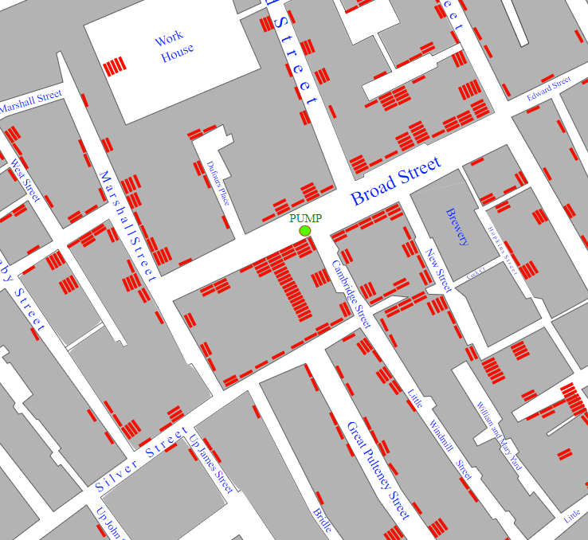

## Ton idée

Utilise cette étape pour planifier ta visualisation de données. Tu peux planifier simplement en pensant, en bricolant, en dessinant ou en écrivant, ou comme bon te semble !

### Pourquoi réalises-tu ta visualisation de données ?

--- task ---

Pense à **l'objectif** de la visualisation de données que tu crées. Il existe **huit** ensembles de données parmi lesquels choisir comme projets de démarrage **ou** tu peux trouver ton propre ensemble de données sur un sujet que tu souhaites mettre en avant auprès des autres.

Utilise un jeu de données qui est important pour toi. Les jeux de données dans les projets de démarrage sont :
+ Expéditions ISS
+ Éruptions volcaniques
+ Traqueur d'OVNI
+ Indice mondial du bonheur
+ Caractéristiques de la race de chien
+ Boissons caféinées
+ Résultats du test de Bechdel
+ Données de la carte Pokémon

--- collapse ---

---
title: Idées pour la visualisation de tes données
---

Le **but** de ta visualisation de données pourrait être de :

+ Montrer les différentes **expéditions** qui ont eu lieu sur l'**ISS**
+ Démontrer les races de **chiens les plus intelligentes**
+ Classer les différents types **d'observations d'ovnis** et où ils sont principalement situés
+ Afficher les zones à travers le monde qui ont connu des **éruptions volcaniques**
+ Découvrir les régions du monde qui sont les **meilleurs endroits où vivre** (selon l'indice de bonheur)
+ Afficher les personnages **Pokémon** les plus puissants
+ Analyser les niveaux **de caféine** dans les boissons populaires
+ Découvrir les **films** qui ont les meilleurs **résultats au test Bechdel** (il s'agit d'un ensemble de données qui examine la façon dont les femmes sont représentées dans les films)

--- /collapse ---

Tu peux aussi choisir les tiens, un bon endroit pour explorer d'autres ensembles de données est [Kaggle](https://www.kaggle.com/datasets){:target="_blank"}.

**Astuce :** si tu vas utiliser ton propre jeu de données et que tu veux placer des formes sur une carte du monde, tu devras avoir des données qui contiennent les emplacements **longitude** et **latitude** pour les éléments que tu souhaites afficher.

--- /task ---

En 1854, le médecin John Snow pensait que l'épidémie de choléra dans le quartier de Soho à Londres était due à un approvisionnement en eau contaminée - contrairement à la croyance communément admise selon laquelle le choléra était causé par le « mauvais air » du quartier. Pour aider à prouver sa théorie, Snow a cartographié les décès dus au choléra dans la région. La carte montrait clairement que les décès étaient concentrés autour de Broad Street et que les habitants tiraient leur eau de la pompe de cette rue. En visualisant les données de cette manière, il a réussi à convaincre la municipalité de désactiver la pompe à eau. Il était largement reconnu que cette visualisation avait contribué à sauver de nombreuses vies.

{:width="200px"}

### À qui s'adresse-t-il ?

--- task ---

Pense à qui tu destines ta visualisation de données (ton **public**).

Quelle est la **signification** de ta visualisation ? Cela met-il en évidence quelque chose de spécifique sur le monde qui nous entoure ?

Les couleurs, les formes, les images ou les graphiques signifieront-ils **quelque chose de spécial** pour toi ou ton public ?

Partager ta visualisation de données est un excellent moyen d'exprimer quelque chose à propos de toi, de tes intérêts ou de ta culture.

--- /task ---

### Commencer

--- task ---

Sélectionne le bon **projet de démarrage** pour la visualisation de données que tu as choisie. Le Code Editor Raspberry Pi s'ouvre dans une nouvelle fenêtre. Assure-toi que tu es **connecté** et clique sur **Save** pour enregistrer une copie dans tes projets.

**Expédition ISS** le [projet de démarrage](https://editor.raspberrypi.org/en/projects/data-iss-starter){:target="_blank"}.

**Éruptions volcaniques** le [projet de démarrage](https://editor.raspberrypi.org/en/projects/data-volcano-starter){:target="_blank"}.

**Traqueur d'OVNI** le [projet de démarrage](https://editor.raspberrypi.org/en/projects/data-ufo-starter){:target="_blank"}.

**Indice mondial du bonheur** le [projet de démarrage](https://editor.raspberrypi.org/en/projects/data-happiness-starter){:target="_blank"}.

**Caractéristiques de la race de chien** le [projet de démarrage](https://editor.raspberrypi.org/en/projects/data-dogs-starter){:target="_blank"}.

**Boissons caféinées** le [projet de démarrage](https://editor.raspberrypi.org/en/projects/data-caffeine-starter){:target="_blank"}.

**Résultats du test de Bechdel** le [projet de démarrage](https://editor.raspberrypi.org/en/projects/data-bechdel-starter){:target="_blank"}.

**Données de la carte Pokémon** le [projet de démarrage](https://editor.raspberrypi.org/en/projects/data-cards-starter){:target="_blank"}.

**Utiliser ton propre jeu de données**

Si tu utilises ton propre jeu de données, tu devras utiliser le projet de démarrage [vide](https://editor.raspberrypi.org/en/projects/data-blank-starter){:target="_blank"}. Tu devras également **ajouter** ton propre jeu de données.

--- collapse ---
---
title: Ajouter ton propre jeu de données
---

Une fois que tu as trouvé ton propre jeu de données, tu devras le** télécharger** sous forme de fichier CSV.

Tu devrais alors **ouvrir** le fichier et le vérifier s'il y a des données manquantes ou inhabituelles.

**Astuce 1 :** c'est une bonne idée de supprimer une **ligne entière** de données si elle comporte des sections vides. Cela aidera à éviter des problèmes avec ton code ultérieurement.

**Astuce 2 :** regarde attentivement les données de ton fichier CSV. Peux-tu voir des symboles inhabituels à l'endroit où le texte devrait se trouver ? Si c'est le cas, tu peux également supprimer ces lignes. Une autre option est de supprimer les symboles tant que cela ne change pas la signification des données.

**Astuce 3 :** si tes données ont beaucoup de colonnes supplémentaires que tu ne vas pas utiliser pour ta visualisation, alors c'est une bonne idée de les supprimer. Cela facilitera la navigation et l'accès à tes données à partir de ton code.

Une fois que tu es convaincu que tes données sont correctes, il est temps de les ajouter à ton projet. Voici comment :

1. Assure-toi que tu as enregistré ton fichier CSV en tant que fichier CSV. Si tu l'as modifié dans un tableur, tu devras peut-être changer le type de fichier en CSV **avant** d'appuyer sur Enregistrer.
2. Trouve l'emplacement de ton fichier CSV. Il sera probablement dans ton dossier de téléchargements si tu le télécharges depuis un site comme Kaggle.
3. Ouvre le fichier avec le bloc-notes (fais un clic droit sur le fichier et choisis **Ouvrir avec** > **Bloc-notes**).
4. Supprime la ligne d'en-tête (haut) de données car tu n'en auras pas besoin pour ton programme.
5. Fais défiler vers le bas de ton fichier et vérifie qu'il n'y a pas d'espace vide en bas de page. Si c'est le cas, supprime-le.
7. Va dans ton projet dans le Code Editor.
8. Clique sur le bouton `+ Add file`.
9. Donne-lui un nom judicieux (par exemple `mesdonnees.csv`) puis clique sur `Add file` pour confirmer.
10. Copie toutes les données du bloc-notes (Sélectionner tout > Copier), puis colle-les dans ton nouveau fichier de ton projet.

--- /collapse ---

--- /task ---

### Configurer ton projet

--- task ---

### Ajouter tes relevés d'importation et ton code de démarrage

--- collapse ---
---
title: Utiliser p5 pour dessiner des formes, des cartes et des images
---

Si tu vas dessiner des formes en utilisant `p5` alors tu devras inclure l'instruction d'importation en haut de ton code.

L'instruction import importe **tout** le code `p5`.

Pour utiliser p5, tu devras également créer deux fonctions et inclure l'appel de fonction `run()` .

**Fonction une**

--- code ---
---
language: python filename: main.py line_numbers: false line_number_start: 1
line_highlights: 1-7
---
from p5 import *

def setup():  # Runs once at the start size(400, 400)  # Choose the size of your canvas

def draw():  # Runs every frame

run()

--- /code ---

--- /collapse ---

--- collapse ---
---
title: Utiliser xy pour placer des données sur une carte
---

Si ton fichier CSV contient des données de longitude et de latitude, tu peux l'utiliser pour placer des objets sur une carte du monde. Le fichier `xy.py` a été créé pour te permettre de convertir les données de latitude et de longitude en coordonnées xy pouvant être utilisées dans ton programme.

Pour utiliser le fichier `xy.py`, tu auras besoin de l'instruction d'importation suivante en haut de ton code :

--- code ---
---
language: python filename: main.py line_numbers: false line_number_start: 1
line_highlights:
---
from xy import get_xy_coords

--- /code ---

--- /collapse ---

--- collapse ---
---
title: Utiliser pygal pour créer des graphiques
---

Si ton projet te demande de créer des graphiques et des graphiques, tu devras utiliser **pygal**. La ligne de code suivante importe **pygal** dans ton programme :

--- code ---
---
language: python filename: main.py line_numbers: false line_number_start: 1
line_highlights:
---
from pygal import * --- /code ---

L'instruction import importe **tout** le code de la bibliothèque pygal.

--- /collapse ---

--- /task ---

--- save ---
