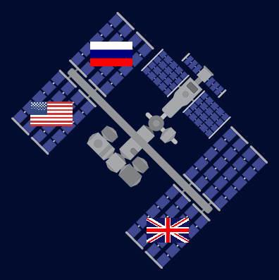

## Construire et tester - Dessiner ou construire un graphique

Il est maintenant temps de réaliser ton projet de visualisation de données.



Pour réussir un projet de programmation, tu dois utiliser les compétences de **décomposition** pour décomposer le problème en parties plus petites et plus faciles à gérer. Cela signifie que tu dois prendre chaque partie à la fois et la faire fonctionner avant de passer à la partie suivante.

**Astuce :** teste ton code après chaque nouvelle section pour qu'il soit plus facile de trouver et de corriger de nouvelles erreurs.

--- collapse ---
---
title: Exemple de décomposition
---

Ton idée nécessite qu'un dessin apparaisse à l'écran en fonction des données contenues dans un fichier texte ou csv ? Si c'est le cas, tu peux décomposer ce problème de la manière suivante :

1. Écrit le code pour dessiner une forme ou charger une image
2. Fais apparaître l'image au centre de l'écran pour la tester
3. Charge les données requises depuis le fichier texte ou csv
4. `print()` les données dont tu as besoin pour l'emplacement de l'image pour vérifier que le code fonctionne
5. Utilise les données pour placer l'image au bon endroit

--- /collapse ---

Pense aux étapes que tu devras suivre pour réussir ton projet. Auras-tu besoin d’afficher un graphique ou une image ? De quelles compétences auras-tu besoin pour y parvenir ?

--- task ---

Tu as acquis des compétences vraiment utiles. Voici un rappel pour t'aider à réaliser ta visualisation de données :

### Formes et images

[[[p5-coordinates]]]

[[[processing-python-ellipse]]]

[[[processing-python-rect]]]

[[[processing-python-triangle]]]

[[[processing-python-quad]]]

--- collapse ---

---
title: Utiliser les caractères emoji
---

Tu peux utiliser des caractères emoji dans la fonction p5 text() pour utiliser un emoji pour représenter ton joueur.

Voici un exemple :

--- code ---
---
language: python
filename: main.py
line_numbers: 
line_number_start: 
line_highlights: 
---
def setup():
  size(400, 400)
  text_align(CENTER, TOP)  # Position autour du centre

def dessin_emoji(emoji, taille):  # serpent
  text_size(taille)  # contrôle la taille de l'emoji
  text(emoji, 200, 200)
  
--- /code ---

--- /collapse ---

[[[processing-translation]]]

[[[processing-rotation]]]


--- collapse ---
---
title: Placer une forme en fonction de la latitude et de la longitude
---

Le fichier `xy.py` est disponible dans tous les projets de démarrage. Ce fichier prendra les données **longitude** et **latitude** de ton fichier **CSV** et renverra les coordonnées d'une forme à placer sur une image.

L'exemple de code ci-dessous montre les données `longitude` et `latitude` accessibles à partir du dictionnaire. Il transmet ensuite ces données comme arguments dans la fonction `obt_xy_coords` qui renvoie ensuite les coordonnées.

--- code ---
---
language: python
filename: 
line_numbers: false
line_number_start: 1
line_highlights: 10-12
---
def dessine_donnees():

  no_stroke()

  # Utilise les données de latitude et de longueur pour calculer les coordonnées x y de la forme

  i = 255

  for eruption in eruptions_volcan:
    longitude = float(eruption['longitude'])
    latitude = float(eruption['latitude'])
    region_coords = obt_xy_coords(longitude, latitude)  # retourne les coordonnées pour placer l'épingle de la carte
    region_x = region_coords['x']
    region_y = region_coords['y']
    couleur = Color(i, 255, 255)
    couleurs[couleur.hex] = eruption
    dessiner_volcan(couleur, region_x, region_y)
    i -= 2
--- /code ---

--- /collapse ---

### Couleurs et effets

[[[generic-theory-simple-colours]]]

--- collapse ---

---
title: Couleur en p5
---

La fonction p5 Color() attend trois nombres : un pour le rouge, le vert et le bleu.

--- code ---
---
language: python
filename: main.py
line_numbers: false
line_number_start: 1
line_highlights: 1
---
bleu = Color(50, 70, 206)  # Rouge = 50, Vert = 70, Bleu = 206

--- /code ---

--- /collapse ---

[[[processing-opacity]]]

[[[processing-stroke]]]

[[[processing-tint]]]

--- collapse ---
---
title: Modifier la valeur d'une couleur d'épingle de carte
---
Cet exemple modifie la valeur du rouge à chaque fois que le code place une épingle :

**N'oublie pas** de définir également un dictionnaire de `couleurs` dans la partie principale de ton code, généralement vers le haut.

--- code ---
---
language: python
filename: 
line_numbers: false
line_number_start: 
line_highlights: 1, 9, 17-20
---
couleurs = {}

def dessine_donnees():

  no_stroke()

  # Utilise les données de latitude et de longueur pour calculer les coordonnées x y de la forme

  rouge = 255

  for eruption in eruptions_volcan:
    longitude = float(eruption['longitude'])
    latitude = float(eruption['latitude'])
    region_coords = obt_xy_coords(longitude, latitude)
    region_x = region_coords['x']
    region_y = region_coords['y']
    couleur = Color(rouge, 0, 0)
    couleurs[couleur.hex] = eruption
    dessiner_volcan(couleur, region_x, region_y)
    rouge -= 2
--- /code ---


--- /collapse ---

--- collapse ---
---
title: Changer la valeur de plusieurs couleurs d'épingles de carte
---

Cet exemple modifie les valeurs du rouge, du vert et du bleu à chaque fois que le code place une épingle :

**N'oublie pas** de définir également un dictionnaire de `couleurs` dans la partie principale de ton code, généralement vers le haut.

--- code ---
---
language: python
filename: 
line_numbers: false
line_number_start: 
line_highlights: 1, 9-11, 19-24 
---
couleurs = {}

def dessine_donnees():

    no_stroke()
    
    # Utilise les données de latitude et de longueur pour calculer les coordonnées x y de la forme
    
    rouge = 255
    vert = 0
    bleu = 255
    
    for eruption in eruptions_volcan:
        longitude = float(eruption['longitude'])
        latitude = float(eruption['latitude'])
        region_coords = obt_xy_coords(longitude, latitude)
        region_x = region_coords['x']
        region_y = region_coords['y']
        couleur = Color(rouge, vert, bleu)
        couleurs[couleur.hex] = eruption
        dessiner_volcan(couleur, region_x, region_y)
        rouge -= 1  # Change the red value
        vert += 1  # Change the green value
        bleu -= 1  # Change the blue value
--- /code ---

--- /collapse ---

--- collapse ---
---
titre: Choisir des couleurs aléatoires pour tes épingles de carte
---

Au début de ton code, avec tes autres imports, tu devras importer `randint` depuis la bibliothèque `random`.

Tu devras également définir un dictionnaire `couleurs` dans la partie principale de ton code. Ceci est généralement placé sous tes déclarations d'importation.

Tu peux alors choisir une couleur aléatoire pour les couleurs de ta région, à chaque fois autour de la boucle for. Il y a une petite chance que deux couleurs ou plus finissent par être les mêmes, mais c'est une très petite chance.

**Attention :** choisir des couleurs aléatoires signifie que tes épingles changeront de couleur à chaque boucle.

--- code ---
---
language: python
filename: 
line_numbers: false
line_number_start: 
line_highlights: 1, 3, 17-19
---
from random import randint

couleurs = {}

def dessine_donnees():

  no_stroke()

  # Utilise les données de latitude et de longueur pour calculer les coordonnées x y de la forme

  for eruption in eruptions_volcan:
    longitude = float(eruption['longitude'])
    latitude = float(eruption['latitude'])
    region_coords = obt_xy_coords(longitude, latitude)
    region_x = region_coords['x']
    region_y = region_coords['y']
    couleur = Color(randint(0,255), randint(0,255), randint(0,255))  # Sélectionne une couleur aléatoire
    couleurs[couleur.hex] = eruption
    dessiner_volcan(couleur, region_x, region_y)
--- /code ---


--- /collapse ---

--- collapse ---
---
title: Définir les couleurs d’arrière-plan au démarrage de ton programme
---

Définis une nouvelle fonction appelée `dessine_arriere_plan()` et crée un appel à celle-ci dans `draw():`, après un appel à `no_stroke()`.

--- code ---
---
language: python
filename: main.py - draw_background()
line_numbers: false
line_number_start: 1
line_highlights: 1-4
---
def dessine_arriere_plan(couleur):
    # Couleur de l'arrière-plan
    fill(couleur)
    rect(0, 0, 400, 400)

--- /code ---

Puis crée un appel avec `draw()`:

--- code ---
---
language: python
filename: main.py - draw()
line_numbers: false
line_number_start: 1
line_highlights: 8
---
def draw():

    rouge = Color(255,0,0)
    vert = Color(0,255,0)
    bleu = Color(0,0,255)
    
    no_stroke()
    Couleur de l'arrière-plan(rouge)

--- /code ---

Si tu veux que ton arrière-plan inclue plus de couleurs, tu devras ajouter plus de paramètres.

--- code ---
---
language: python
filename: main.py - draw_background()
line_numbers: false
line_number_start: 1
line_highlights: 1, 6-7
---
def dessine_arriere_plan(vert, bleu):

    # Couleur de l'arrière-plan
    fill(bleu)
    rect(0, 0, 400, 200)
    fill(vert)
    rect(0, 200, 400, 200)

--- /code ---

Puis crée un appel avec `draw()`:

--- code ---
---
language: python
filename: main.py - draw()
line_numbers: false
line_number_start: 1
line_highlights: 7-8
---
def draw():

    rouge = Color(255, 0, 0)
    vert = Color(0, 255, 0)
    bleu = Color(0, 0, 255)
    
    no_stroke()
    dessine_arriere_plan(vert, bleu)

--- /code ---

--- /collapse ---

### Charger des données à partir de fichiers texte

--- collapse ---
---
title: Charger des données dans une variable
---

Pour écrire le **contenu entier** d'un fichier texte dans une **variable**, tu peux utiliser le code suivant :

--- code ---
---
language: python
filename: main.py
line_numbers: false
line_number_start: 
line_highlights: 
---
mon_fichier_texte = ''  # Initialise la variable pour qu'elle puisse y être ajoutée

with open('filename.csv') as f:  # Ouvre le fichier temporairement
    for ligne in f:  # Boucle à travers chaque ligne du fichier
        mon_fichier_texte += ligne  # Ajoute la ligne au contenu actuel de la variable

--- /code ---

Cela peut être un extrait de code utile si tu travailles avec de très petits fichiers texte et que tu n'as pas l'intention d'effectuer beaucoup d'actions sur les données chargées. Par exemple, tu voudrais juste afficher le contenu du fichier texte.

--- /collapse ---

--- collapse ---
---
title: Charger les données dans une seule liste
---
Pour écrire **chaque ligne** d'un fichier texte en tant qu'élément **distinct** dans une liste, tu peux utiliser le code suivant :

--- code ---
---
language: python
filename: main.py
line_numbers: false
line_number_start: 
line_highlights: 
---
mon_fichier_texte = []  # Initialise la liste afin que les données puissent y être ajoutées (ajoutées)

with open('filename.csv') as f:  # Ouvre le fichier temporairement
    for ligne in f:  # Boucle à travers chaque ligne du fichier
        mon_fichier_texte.append(ligne)  # Ajoute la ligne au contenu actuel de la variable
--- /code ---

Cela peut être utile si ton fichier texte ne contient qu'**un** élément de données sur **chaque ligne**. Par exemple, il peut s'agir d'une liste de noms de joueurs pour un jeu.

--- /collapse --- 

--- collapse ---
---
title: Charger les données dans une liste de listes (une liste 2D)
---
Une liste de listes est souvent appelée liste 2D. Lorsque les données sont stockées dans un fichier CSV, chaque élément d'une ligne (rangée) est séparé par une virgule `,`.


Tu peux utiliser cette virgule pour créer une liste des éléments pour chaque ligne. Un extrait de code pour cela peut être vu ci-dessous à **ligne 5** :

--- code ---
---
language: python
filename: main.py
line_numbers: true
line_number_start: 1
line_highlights: 5
---
mon_fichier_texte = []

with open('filename.csv') as f:
    for ligne in f:
        info = ligne.split(',')  # Divise chaque élément séparé par une virgule dans une liste

print(info)

--- /code ---

Si tu exécutes le code ci-dessus, il affichera **la dernière ligne** du fichier CSV sous forme de liste. En effet, pour chaque ligne, la liste `info` a été recréée. Elle n'a pas été ajoutée.

```
['29/12/2020', '6.4', '2.733333333', 'Autour de 94nm au sud de Brass\n']
```

Pour stocker **toutes** les données, tu peux créer une **liste de listes** !

Le code ci-dessous utilise le même code que ci-dessus mais maintenant il **ajoute** la liste `info` à la liste `mon_fichier_texte` à la **ligne 6**. Cela signifie que tu peux maintenant stocker toutes les données du fichier CSV.

--- code ---
---
language: python
filename: main.py
line_numbers: true
line_number_start: 1
line_highlights: 6
---
mon_fichier_texte = []

with open('filename.csv') as f:
    for ligne in f:
        info = ligne.split(',')
        mon_fichier_texte.append(info)  # Ajoute la liste d'informations à la liste mon_fichier_texte

print(mon_fichier_texte)

--- /code ---

Les listes 2D sont très utiles pour stocker et parcourir de grandes quantités de données. Cependant, tu dois être très au courant de **ce qui** est stocké et **où** est stocké.

--- /collapse ---

--- collapse ---
---
title: Charger des données dans une liste de dictionnaires
---
Chaque ligne (ligne) d'un fichier CSV peut être stockée dans un **dictionnaire**. Le fichier CSV ci-dessous contient des données sur les éruptions volcaniques ayant eu lieu depuis 2010. Chaque ligne est une nouvelle éruption. Chaque éruption contient des informations sur la date, la longitude, la latitude et l'emplacement, ainsi que d'autres éléments.


Si ces données étaient stockées dans une liste 2D, tu aurais alors besoin de connaître les valeurs `d'index` des données pour y accéder. Avec un **dictionnaire**, tu as juste besoin de connaître la `clé`. C'est le mot clé utilisé pour représenter les données conservées pour chaque événement. Dans cet exemple, les clés sont `date`, `longitude`, `latitude`et `emplacement`.

Le code ci-dessous montre une **liste de dictionnaires** créés pour le contenu d'un fichier CSV :

--- code ---
---
language: python
filename: main.py
line_numbers: false
line_number_start: 1
line_highlights: 
---
eruptions_volcan = []  # Initialiser la liste pour stocker les éruptions

with open(file_name) as f:
    for ligne in f:
    info = ligne.split(',')  # Diviser la ligne en une liste
    dict_volcan = { # Créer un dictionnaire pour l'événement
        'date': info[0],
        'longitude': info[1],
        'latitude': info[2],
        'lieu': info[3]
    }
    eruptions_volcan.append(dict_volcan)  # Stocker le dictionnaire dans une liste

--- /code ---

--- /collapse ---

--- collapse ---
---
title: Supprimer le \n
---
Quand tu regardes un fichier texte dans sa forme brute, il n'y a pas de `\n` à la fin de chaque ligne. Cependant, lorsque tu charges chaque ligne d'un fichier texte, tu verras qu'un `\n` apparaît. En effet, `\n` signifie **ajouter une nouvelle ligne**. Sans cela, toutes les lignes de texte seraient sur une seule et très longue ligne.

Cela n'est pas utile lorsque tu veux utiliser les données dans ton programme.

Pour supprimer le `\n` tu peux utiliser la méthode `strip()`. Cela supprime tout ce que tu écris entre parenthèses des données.

Tu peux voir un exemple de ceci utilisé à la **ligne 3** ci-dessous :

--- code ---
---
language: python
filename: main.py
line_numbers: true
line_number_start: 1
line_highlights: 3
---
with open(file_name) as f:
    for ligne in f:  # Pour chaque ligne dans le fichier texte
        info = ligne.strip('\n')  # Enleve le \n
        info = info.split(',')

--- /code ---


--- /collapse ---

### Accéder aux données des listes et dictionnaires

[[[generic-python-list-index]]]

--- collapse ---
---
title: Accéder aux données d'un dictionnaire
---

Un dictionnaire a été créé pour stocker les observations d'ovnis :

--- code ---
---
language: python
filename: main.py
line_numbers: true
line_number_start: 
line_highlights: 
---
    dict_ovni = {
        'date': '12-1-2020',
        'heure': '13:55',
        'etat': 'TX',
        'pays': 'États-Unis d'Amérique'
    }

--- /code ---

Les données sont stockées dans un dictionnaire à l'aide d'une **clé**, qui est l'étiquette ou le mot-clé des données.

Les **clés** de ce dictionnaire sont :
+ Date
+ Heure
+ État
+ Pays

Si tu voulais connaître la **date** de l'observation d'ovni, tu utiliserais cet extrait de code :

--- code ---
---
language: python
filename: main.py
line_numbers: false
line_number_start: 
line_highlights: 
---
dict_ovni['date']

--- /code ---

--- /collapse ---

--- collapse ---
---
title: Accéder aux données à partir d’une liste de dictionnaires
---

Lorsque tu crées une liste de dictionnaires, tu peux parcourir la liste pour rechercher et utiliser les données dont tu as besoin.

### Exemple 1 – expéditions ISS

Voici un exemple de code utilisé pour trouver la date d'une expédition vers l'ISS :

--- code ---
---
language: python
filename: main.py
line_numbers: true
line_number_start: 1
line_highlights: 
---
for expedition in expeditions:  # Parcourir tous les dictionnaires d'expédition de la liste des expéditions

    if expedition['numéro d'expédition'] == 3:  # Vérifier si le numéro d'expédition est égal à 3
        date = expedition['date de lancement de la mission']  # Si vrai, stocker la date de lancement de la mission correspondante

--- /code ---

Remarque comment le code `expedition['numéro d'expédition']` a été utilisé pour accéder aux données du dictionnaire.

`expedition` est utilisé comme espace réservé temporaire pour parcourir la liste. À chaque itération, `expedition` contient le dictionnaire d'expédition **actuel**. La **clé** est alors nommée dans les crochets pour accéder aux données.

### Exemple 2 - Observations d'ovnis

Voici un autre exemple qui a été utilisé pour trouver les valeurs de latitude et de longitude pour les observations d'ovnis.

--- code ---
---
language: python
filename: main.py
line_numbers: true
line_number_start: 1
line_highlights: 
---
for observation in observations_ovni:  # Parcourir tous les dictionnaires d'observation de la liste observation_ovni

    longitude = float(observation['longitude'])  # Stocker les données de longitude
    latitude = float(observation['latitude'])  # Stocker les données de latitude
--- /code ---

Tu peux voir le même schéma se produire avec cet exemple que dans le premier exemple. La boucle parcourt la liste des dictionnaires. Pour chaque boucle, `observation` est utilisée comme espace réservé temporaire pour le dictionnaire. La **clé** est ensuite utilisée pour accéder aux données de latitude et de longitude requises.

Dans ce cas, `float()` a également été utilisé car les données devaient être stockées sous forme de nombre décimal.

--- /collapse ---

### Afficher des graphiques

[[[pygal-library]]]

--- /task ---

--- task ---

**Test :** montre ton projet à quelqu'un d'autre pour avoir son avis.
+ Si tu crées des graphiques, es-tu satisfait du type de graphique que tu as affiché et des données que tu as utilisées ?
+ Si tu ajoutes des dessins sur une carte, es-tu satisfait des formes que tu as choisies ?
+ Si tu crées un autre type de visualisation, pourrait-on l'améliorer d'une manière ou d'une autre ?

--- /task ---

--- task ---

**Débogage :** tu pourrais trouver des bogues dans ton projet que tu dois corriger. Voici quelques bogues courants.

--- collapse ---
---
title: Le message "index out of range" (index hors de portée) s'affiche en permanence
---

Le message d'erreur `index out of range` fait généralement référence à ton code essayant d'accéder à un **élément** dans une **liste** qui n'existe pas.

Si ta liste est liée à un fichier texte :
+ Vérifie que ton fichier texte n'a pas de ligne vide en bas
+ Vérifie que les lignes dans ton fichier texte ont toutes la même quantité d'éléments (ce n'est pas toujours nécessaire mais dans ce cas, cela pourrait causer un problème)

--- /collapse ---

--- collapse ---
---
title: Les données ne sont pas tracées sur ma carte comme prévu
---

Un fichier a été créé pour t'aider dans cette tâche, il s'appelle `xy.py`. Il s'agit d'un fichier supplémentaire dans les projets de démarrage où les données **latitude** et **longitude** ont été incluses dans le fichier CSV.

Le code de ce fichier peut être consulté ci-dessous :

--- code ---
---
language: python
filename: xy.py
line_numbers: true
line_number_start: 1
line_highlights: 
---
from math import radians, pi, log, tan

def convert_lat_long(latitude, longitude, largeur_carte, hauteur_carte):

    fausse_ordonnee = 180
    rayon = largeur_carte / (2 * pi)
    latitude = radians(latitude)
    longitude = radians(longitude + fausse_ordonnee)
    
    x_coord = longitude * rayon
    
    y_dist_depuis_equateur = rayon * log(tan(pi / 4 + latitude / 2))
    y_coord = hauteur_carte / 2 - y_dist_depuis_equateur
    
    coords = {'x': x_coord, 'y': y_coord}
    
    return coords


def obt_xy_coords(longitude, latitude, largeur_carte=991, hauteur_carte=768):

    coords = None
    
    coords = convert_lat_long(latitude, longitude, largeur_carte, hauteur_carte)
    return coords

--- /code ---

Ce code prend les données **longitude** et **latitude**, effectue certaines tâches puis renvoie les coordonnées x et y pour placer le dessin au bon endroit.

Si tu utilises ce fichier :
+ Vérifie que tu l'as importé en haut de ton programme principal. Il doit être indiqué `from xy import obt_xy_coords`.
+ Vérifie que tu transmets les données **longitude** et **latitude** dans le bon ordre. Ton appel de fonction devrait être similaire à ceci : `obt_xy_coords(longitude, latitude)`.
+ Vérifie que les données de longitude et de latitude ont été converties au type de données **float** . Ton code devrait ressembler à ceci : `longitude = float(observation['longitude'])`.

--- /collapse ---

--- collapse ---
---
title: Quelque chose n'est "pas défini" (not defined)
---

C'est une erreur courante. Cela signifie généralement qu'une variable, un dictionnaire ou une liste est en train d'être consultée ou modifiée avant qu'elle n'ait été définie.

Par exemple, tu peux utiliser ce code pour ajouter un élément à une liste :

--- code ---
---
language: python
filename: main.py
line_numbers: true
line_number_start: 1
line_highlights: 
---
etat = 'TX'

donnees_ovni.append(etat)
--- /code ---

Cette ligne de code provoquera un message d'erreur car la liste `donnees_ovni` n'a pas encore été définie. Pour corriger cette erreur, tu dois ajouter une ligne de code qui définit la liste.

--- code ---
---
language: python
filename: main.py
line_numbers: true
line_number_start: 1
line_highlights: 1
---
donnees_ovni = []

etat = 'TX'

donnees_ovni.append(etat)

--- /code ---

--- /collapse ---

--- collapse ---
---
title: Mon graphique ne s'affiche pas
---

Vérifie que tu as inclus le code pour afficher le graphique à l'écran :

--- code ---
---
language: python
filename: main.py
line_numbers: true
line_number_start: 1
line_highlights: 
---
graphique.render()

--- /code ---

Tu devras peut-être également vérifier que tu convertis des valeurs numériques en `float()` pour les nombres décimaux ou `int()` pour les nombres entiers dans ton code.

--- /collapse ---

Tu pourrais trouver un bogue qui n'est pas répertorié ici. Peux-tu trouver un moyen de le corriger ?

**Astuce :** trouve l'exemple de projet qui ressemble le plus au tien et étudie attentivement le code qui a été utilisé pour le faire fonctionner. Cela peut t'aider à repérer des choses que tu pourrais avoir manquées dans ton propre programme.

Nous aimerions connaître tes bogues et la façon dont tu les as résolus. Utilise le bouton Envoyer un commentaire au bas de cette page si tu as trouvé un bogue différent dans ton projet.

--- /task ---


--- save ---
