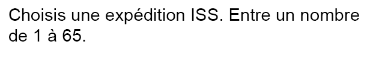

## Développer et tester – Interaction utilisateur

Il est maintenant temps d'ajouter une interaction utilisateur à ta visualisation de données !



--- task ---

Regarde le projet [**projet d'expédition ISS**](https://editor.raspberrypi.org/en/projects/data-iss-example){:target="_blank"}. Il demande à l'utilisateur de choisir une expédition ISS à explorer. L'utilisateur saisit un numéro et ce numéro est ensuite utilisé pour :
+ Accéder aux données pertinentes pour cette expédition
+ Dessiner des drapeaux sur l'ISS sur la base des données
+ Afficher les données d'expédition pertinentes en sortie pour l'utilisateur

Ton projet pourrait-il faire quelque chose de similaire ?

--- /task ---

--- task ---

Regarde le projet [**Traqueur d'OVNI**](https://editor.raspberrypi.org/en/projects/data-ufo-example){:target="_blank"}. Ce projet permet à l'utilisateur de cliquer sur les différentes formes affichées sur la carte. Lorsque l'utilisateur clique sur un objet, un message s'affiche indiquant le **type** d'OVNI qui a été repéré à cet endroit.

Pourrais-tu utiliser cette idée pour t'aider à ajouter une interaction utilisateur à ton projet ?

--- /task ---

--- task ---

Explore le projet [**Analyse des chiens jouets**](https://editor.raspberrypi.org/en/projects/data-dogs-example){:target="_blank"}. Cela demande à l'utilisateur de choisir quel type de données est affiché pour lui dans un graphique.

Pourrais-tu donner à tes utilisateurs des options sur le type de données qu'ils souhaitent voir ?

Pense à ton propre projet et aux données que tu veux que tes utilisateurs puissent explorer. Inspire-toi des exemples de projets et pense à la façon dont ton utilisateur peut interagir avec le projet.

--- /task ---

--- task ---

Ajoute une interaction utilisateur à ton projet. Voici un rappel de certaines des compétences dont tu pourrais avoir besoin pour cela :

--- collapse ---
---
title: Choisir ce qui se passe quand une couleur spécifique est cliquée
---

Tu peux créer une fonction `mouse_pressed()` pour travailler avec la bibliothèque `p5`. Cela permet d'exécuter une tâche lorsque l'on appuie sur la souris.

Le code ci-dessous récupère la couleur hexadécimale du pixel sur lequel a été cliqué la souris :

--- code ---
---
language: python filename: main.py line_numbers: false line_number_start: 1
line_highlights:
---
pixel_colour = Color(get(mouse_x, mouse_y)).hex

--- /code ---

Ce morceau de code peut être utilisé avec une instruction de sélection (`if`) pour faire en sorte que quelque chose se produise en fonction de la couleur du pixel.

Un exemple de ceci peut être vu dans le projet **Observations d'ovnis** :

--- code ---
---
language: python filename: main.py - mouse_pressed() line_numbers: false line_number_start:
line_highlights:
---
def mouse_pressed():

  # Display a message depending on what shape the user has pressed

    pixel_colour = Color(get(mouse_x, mouse_y)).hex
    if pixel_colour == fireball.hex:
        print('A fireball UFO was spotted here!')
    elif pixel_colour == circle.hex:
        print('A circle-shaped UFO was spotted here!')
    elif pixel_colour == tri.hex:
        print('A triangle-shaped UFO was spotted here!')
    elif pixel_colour == light.hex:
        print('A UFO made of light was spotted here!')
    elif pixel_colour == disc.hex:
        print('A disc-shaped UFO was spotted here!')
    elif pixel_colour == misc.hex:
        print('A random-shaped UFO was spotted here!')
    elif pixel_colour == cylinder.hex:
        print('A cylinder-shaped UFO was spotted here!')
    else:
        print('There were no UFO sightings in this area!')

--- /code ---

--- /collapse ---

--- collapse ---
---
title: Choisir ce qui se passe quand une région spécifique est cliquée
---
Pour que cela fonctionne correctement, tu dois t'assurer que chaque épingle est d'une couleur différente. Tu dois également t'assurer que la couleur correspond à une région à l’aide d’un dictionnaire. Tu devrais déjà avoir rempli ton dictionnaire `couleurs` en utilisant du code à l'étape précédente.

L'exemple ci-dessous montre l'accès au dictionnaire `couleurs` pour afficher des informations sur la région sur laquelle la souris a cliqué.

--- code ---
---
language: python filename: line_numbers: false line_number_start: 1
line_highlights:
---
def mouse_pressed():
# Put code to run when the mouse is pressed here

    pixel_colour = Color(get(mouse_x, mouse_y)).hex
    if pixel_colour in colours:
        facts = colours[pixel_colour]
        print('A volcano erupted in ' + facts['region'] + ' in ' + facts['year'])
    else:
        print('Region not detected')
--- /code ---

--- /collapse ---


--- collapse ---
---
title: Interaction basée sur la saisie de l'utilisateur
---

Une bonne façon d'interagir avec ton utilisateur est de lui poser une question. Sa réponse peut ensuite être conservée dans une variable et utilisée pour afficher les données demandées. Si tu veux que ta question se produise avant l'affichage d'une carte, d'un graphique ou d'un dessin, alors tu dois t'assurer que c'est l'un des premiers morceaux de code qui s'exécute.

Lieux courants pour poser une question à un utilisateur :
+ Dans la partie principale de ton code (pas à l'intérieur d'une fonction)
+ Dans une fonction `main()`
+ Dans la fonction `setup()` (si tu utilises `p5`)

Voici le code pour poser une question ; cela a été utilisé dans le **projet Indice de bonheur** :

--- code ---
---
language: python filename: main.py - main() line_numbers: false line_number_start: 1
line_highlights:
---
def main(): print('World Happiness Index Data 2019')

    choice = input('''What would you like to see?
        1. How happy are countries overall?
        2. How much does national wealth matter?
        3. How well does your country look after the disadvantaged?
        4. How generous are people?
        5. How fair and honest are people?
        6. How much freedom do you have?
    Choice: ''')

--- /code ---

--- /collapse ---

--- collapse ---
---
title: Utiliser une boucle "while" pour répéter les questions
---

Tu peux utiliser une **boucle while** pour exécuter un morceau de code **pendant** qu'une **condition** est **Vraie**. Dans l'exemple ci-dessous, tant que l'utilisateur **ne choisit pas** `c` ou `f`, la boucle va continuer à s'exécuter. Tu pourrais trouver cela utile à utiliser dans ton propre projet.

--- code ---
---
language: python filename: main.py line_numbers: false line_number_start:
line_highlights:
---
def menu(): choice = ''  # Start with a wrong answer for choice

    while choice != '1' and choice != '2':  # Keep asking the user for the right answer
        choice = input('Please enter 1 to encode/decode text, or 2 to perform frequency analysis: ')
    
    if choice == '1':
        do_something()
    
    elif choice == '2':
        do_something_else()

--- /code ---

--- /collapse ---

--- /task ---

--- task ---

**Test :** exécute ton code et assure-toi qu'il fait ce que tu attends lorsque l'utilisateur entre son choix. Si ton programme propose plusieurs options, assure-toi de tester que **chaque option** fonctionne comme prévu.

Enfin, demande à une autre personne de jeter un coup d'œil à ton programme et de fournir tout commentaire sur l'élément d'interaction utilisateur.

--- /task ---

--- task ---

**Débogage :** tu trouveras ci-dessous quelques bogues potentiels pouvant survenir lors de l'utilisation de l'interaction utilisateur :

--- collapse ---
---
title: La question n'apparaît pas lorsque le programme s'exécute
---
Vérifie que ta question et la fonction `input()` ont été placées dans la bonne partie de ton programme. C'est typiquement :
+ Dans la partie principale de ton code (pas à l'intérieur d'une fonction)
+ Dans une fonction `main()`
+ Dans la fonction `setup()` (si tu utilises `p5`)

--- /collapse ---

--- collapse ---
---
title: Rien ne se passe lorsque l'utilisateur saisit un numéro
---

La fonction `input()` est conçue pour prendre tout ce qu'un utilisateur tape et le renvoyer sous forme de **string**. Cela signifie que dans tes **conditions**, tu dois également utiliser des strings. Tu pourrais avoir une condition qui ressemble à ceci :

```
if choix == 1:
```
Ceci vérifie la valeur **entière** : 1 et non la valeur **string** : 1. Pour corriger cela, tu peux ajouter des apostrophes `'` de chaque côté de ton numéro.

```
if choix == '1':
```

--- /collapse ---

--- collapse ---
---
title: Les données correctes ne s'affichent pas lorsque je clique sur la souris
---

La fonction `mouse_pressed()` que tu as créée est conçue pour vérifier la couleur **pixel** qui a été cliquée sur l'écran. Si tu as deux objets ou plus qui sont de la même couleur, alors ton programme affichera les données de la première condition de la séquence qui est fausse.

Si tu souhaites que ton programme affiche des données différentes pour chaque élément sur lequel l'utilisateur clique, alors elles doivent toutes être d'une **couleur différente**. Tu peux voir un exemple de la façon de coder cela pour tous tes points de données ici :

**Note** que le dictionnaire `couleurs` doit également être défini dans la partie principale de ton code.

--- code ---
---
language: python filename: main.py - draw_data() line_numbers: false line_number_start: 1
line_highlights: 1, 6, 17-20
---
colours = {}

def draw_data():

    no_stroke()
    
    # Use the lat and long data to calculate the x y coords for the shape
    
    red = 255
    
    for eruption in volcano_eruptions:
        longitude = float(eruption['longitude'])
        latitude = float(eruption['latitude'])
        region_coords = get_xy_coords(longitude, latitude)
        region_x = region_coords['x']
        region_y = region_coords['y']
        colour = Color(red, 0, 0)
        colours[colour] = eruption
        draw_volcano(colour, region_x, region_y)
        red -= 2

--- /code ---

**Note** que la couleur est initialement définie sur `valeur_rouge = 255` ; c'est la plus grande quantité de rouge que tu puisses utiliser. Après chaque point de données dessiné, la valeur de `valeur_rouge` est réduite de `1`. Cela garantit que chaque point de données est d’une couleur différente.

--- /collapse ---

--- /task ---


--- save ---
