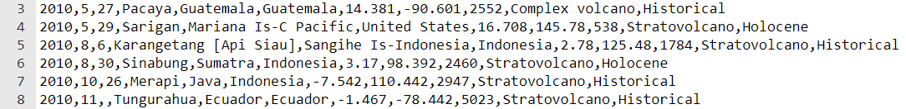

## Bouw en test - Plaatje of grafiek

Nu is het tijd om je data weergave project te maken.


Om succesvol te zijn met een programmeerproject, moet je **decompositie** vaardigheden gebruiken om het probleem op te splitsen in kleinere, beter beheersbare delen. Dit betekent dat je elk onderdeel afzonderlijk maakt en zorgt dat het werkt voordat je doorgaat naar het volgende deel.

**Tip:** Test je code na elke nieuwe sectie, zodat je gemakkelijker nieuwe fouten kunt vinden en oplossen.

--- collapse ---
---
title: Voorbeeld decompositie
---

Vereist je idee dat een plaatje moet worden weergegeven op het scherm gebaseerd op gegevens in een tekst of csv-bestand? Zo ja, dan kun je dit probleem op de volgende manier oplossen:

1. Schrijf de code voor het tekenen van een vorm of het laden van een afbeelding
2. Laat de afbeelding verschijnen in het midden van het scherm om het te testen
3. Laad de benodigde gegevens uit het tekst- of csv-bestand
4. `print()` de gegevens die je nodig hebt voor de afbeeldingslocatie om te controleren of de code werkt
5. Gebruik de gegevens om de afbeelding op de juiste locatie te plaatsen

--- /collapse ---

Denk aan de stappen die je moet nemen voor een succesvol project. Wil je een grafiek of een afbeelding weergeven? Welke vaardigheden heb je nodig om dat mogelijk te maken?

--- task ---

Je hebt een aantal heel nuttige vaardigheden opgebouwd. Hier is een geheugensteuntje om je te helpen bij het maken van jouw data weergave:

### Vormen en afbeeldingen

[[[p5-coordinates]]]

[[[processing-python-ellipse]]]

[[[processing-python-rect]]]

[[[processing-python-triangle]]]

[[[processing-python-quad]]]

--- collapse ---

---
title: Emoji-tekens gebruiken
---

Je kunt emoji-tekens gebruiken in de p5 text() functie om een emoji als speler te gebruiken.

Hier is een voorbeeld:

--- code ---
---
language: python
filename: main.py
line_numbers: 
line_number_start: 
line_highlights: 
---
def setup():
  size(400, 400)
  text_align(CENTER, TOP)  # Positie rond het midden

def draw_emoji(emoji, size):  # slang
  text_size(size)  # bepaalt de grootte van de emoji
  text(emoji, 200, 200)
  
--- /code ---

--- /collapse ---

[[[processing-translation]]]

[[[processing-rotation]]]


--- collapse ---
---
title: Een vorm plaatsen op basis van breedtegraad en lengtegraad
---

Het `xy.py` bestand is beschikbaar in alle startprojecten. Dit bestand neemt de gegevens **lengtegraad** en **breedtegraad** uit je **CSV** bestand en retourneert de coördinaten om een vorm op een afbeelding te plaatsen.

De onderstaande voorbeeldcode toont de gegevens `lengtegraad` en `breedtegraad` die vanuit de dictionary worden opgehaald. Vervolgens worden deze gegevens als argumenten doorgegeven aan de functie `get_xy_coords`, die vervolgens de coördinaten retourneert.

--- code ---
---
language: python
filename: 
line_numbers: false
line_number_start: 1
line_highlights: 10-12
---
def teken_gegevens():

  no_stroke()

  # Gebruik de breedte- en lengte-gegevens om de xy-coördinaten voor de vorm te berekenen

  i = 255
  
  for uitbarsting in vulkaan_uitbarstingen:
    lengtegraad = float(uitbarsting['lengtegraad'])
    breedtegraad = float(uitbarsting['breedtegraad'])
    regio_coordinaten = get_xy_coords(lengtegraad, breedtegraad)  # retourneer coördinaten om kaart speld te plaatsen
    regio_x = regio_coordinaten['x']
    regio_y = regio_coordinaten['y']
    kleur = Color(i, 255, 255)
    kleuren[kleur.hex] = uitbarsting
    draw_vulkaan(kleur, regio_x, regio_y)
    i -= 2
--- /code ---

--- /collapse ---

### Kleuren en effecten

[[[generic-theory-simple-colours]]]

--- collapse ---

---
title: Kleur in p5
---

De p5 Color() functie verwacht drie getallen: één voor rood, groen en blauw.

--- code ---
---
language: python
filename: main.py
line_numbers: false
line_number_start: 1
line_highlights: 1
---
blauw = Color(50, 70, 206)  # Rood = 50, Groen = 70, Blauw = 206

--- /code ---

--- /collapse ---

[[[processing-opacity]]]

[[[processing-stroke]]]

[[[processing-tint]]]

--- collapse ---
---
title: Wijzig de waarde van een speld kleur op de kaart
---
Dit voorbeeld verandert de waarde voor rood elke keer wanneer de code een speld plaatst:

**Denk er aan** om ook een `kleuren` dictionairy te definiëren in het hoofd(main)gedeelte van je code, meestal staat deze bovenaan.

--- code ---
---
language: python
filename: 
line_numbers: false
line_number_start: 
line_highlights: 1, 9, 17-20
---
kleuren = {}

def teken_gegevens():

  no_stroke()

  # Gebruik de breedte- en lengte-gegevens om de xy-coördinaten voor de vorm te berekenen

  rood = 255

  for uitbarsting in vulkaan_uitbarstingen:
    lengtegraad = float(uitbarsting['lengtegraad'])
    breedtegraad = float(uitbarsting['breedtegraad'])
    regio_coordinaten = get_xy_coords(lengtegraad, breedtegraad)
    regio_x = regio_coordinaten['x']
    regio_y = regio_coordinaten['y']
    kleur = Color(rood, 0, 0)
    kleuren[kleur.hex] = uitbarsting
    draw_vulkaan(kleur, regio_x, regio_y)
    rood -= 2
--- /code ---


--- /collapse ---

--- collapse ---
---
title: Wijzig de waarde van meerdere kaartspeldkleuren
---

In dit voorbeeld worden de rode, groene en blauwe waarden gewijzigd telkens wanneer de code een speld plaatst:

**Denk er aan** om ook een `kleuren` dictionairy te definiëren in het hoofd(main)gedeelte van je code, meestal staat deze bovenaan.

--- code ---
---
language: python
filename: 
line_numbers: false
line_number_start: 
line_highlights: 1, 9-11, 19-24  
---
colours = {}

def teken_gegevens():

    no_stroke()
    
    # Gebruik de breedte- en lengte-gegevens om de xy-coördinaten voor de vorm te berekenen
    
    rood = 255
    groen = 0
    blauw = 255
    
    for uitbarsting in vulkaan_uitbarstingen:
        lengtegraad = float(uitbarsting['lengtegraad'])
        breedtegraad = float(uitbarsting['breedtegraad'])
        regio_coordinaten = get_xy_coords(lengtegraad, breedtegraad)
        regio_x = regio_coordinaten['x']
        regio_y = regio_coordinaten['y']
        kleur = Color(rood, groen, blauw)
        kleured[kleur.hex] = uitbarsting
        draw_vulkaan(kleur, regio_x, regio_y)
        rood -= 1  # Wijzig de roodwaarde
        groen += 1  # Wijzig de groenwaarde
        blauw -= 1  # Wijzig de blauwwaarde
--- /code ---

--- /collapse ---

--- collapse ---
---
title: Kies willekeurige kleuren voor je spelden op de kaart
---

Bovenaan je code, bij je andere imports moet je ook `randint` importeren uit de `random` library.

Je zult ook een `kleuren` dictionary in het hoofdgedeelte van je code moeten definiëren. Dit wordt meestal onder je importopdrachten geplaatst.

Je kunt dan een willekeurige kleur kiezen voor jouw regio kleuren, elke keer rond de for-lus. Er is een kans dat twee of meer kleuren hetzelfde zijn, maar deze kans is zeer klein.

**Waarschuwing:** Door willekeurige kleuren te kiezen zullen je pinnen in elke lus van kleur veranderen.

--- code ---
---
language: python
filename: 
line_numbers: false
line_number_start: 
line_highlights: 1, 3, 17-19
---
from random import randint

kleuren = {}

def teken_gegevens():

  no_stroke()

  # Gebruik de breedte- en lengte-gegevens om de xy-coördinaten voor de vorm te berekenen

  for uitbarsting in vulkaan_uitbarstingen:
    lengtegraad = float(uitbarsting['lengtegraad'])
    breedtegraad = float(uitbarsting['breedtegraad'])
    regio_coordinaten = get_xy_coords(lengtegraad, breedtegraad)
    regio_x = regio_coordinaten['x']
    regio_y = regio_coordinaten['y']
    kleur = Color(randint(0,255), randint(0,255), randint(0,255))  # Selecteer een willekeurige kleur
    kleuren[kleur.hex] = uitbarsting
    draw_vulkaan(kleur, regio_x, regio_y)
--- /code ---


--- /collapse ---

--- collapse ---
---
title: De achtergrondkleur instellen wanneer het programma wordt gestart
---

Definieer een nieuwe functie genaamd `draw_background()` en maak een oproep in `draw():`, na een oproep naar `no_stroke()`.

--- code ---
---
language: python
filename: main.py - draw_background()
line_numbers: false
line_number_start: 1
line_highlights: 1-4
---
def draw_background(kleur):
    # Achtergrondkleur
    fill(kleur)
    rect(0, 0, 400, 400)

--- /code ---

Maak daarna een oproep aan in `draw()`:

--- code ---
---
language: python
filename: main.py - draw()
line_numbers: false
line_number_start: 1
line_highlights: 8
---
def draw():

    rood = Color(255,0,0)
    groen = Color(0,255,0)
    blauw = Color(0,0,255)
    
    no_stroke()
    draw_background(rood)

--- /code ---

Als je wilt dat je achtergrond meer kleuren toevoegt, moet je meer parameters toevoegen.

--- code ---
---
language: python
filename: main.py - draw_background()
line_numbers: false
line_number_start: 1
line_highlights: 1, 6-7
---
def draw_background(groen, blauw):

    # Achtergrondkleur
    fill(blauw)
    rect(0, 0, 400, 200)
    fill(groen)
    rect(0, 200, 400, 200)

--- /code ---

Maak daarna een oproep aan in `draw()`:

--- code ---
---
language: python
filename: main.py - draw()
line_numbers: false
line_number_start: 1
line_highlights: 7-8
---
def draw():

    rood = Color(255, 0, 0)
    groen = Color(0, 255, 0)
    blauw = Color(0, 0, 255)
    
    no_stroke()
    draw_background(groen, blauw)

--- /code ---

--- /collapse ---

### Gegevens uit tekstbestanden laden

--- collapse ---
---
title: Gegevens in een variabele laden
---

Om de **volledige inhoud** van een tekstbestand naar een **variabele**te schrijven, kun je de volgende code gebruiken:

--- code ---
---
language: python
filename: main.py
line_numbers: false
line_number_start: 
line_highlights: 
---
my_text_file = ''  # Initialiseert de variabele zodat deze eraan kan worden toegevoegd

with open('filename.csv') as f:  # Opent het bestand tijdelijk
    for line in f:  # Loopt door elke regel in het bestand
        my_text_file += line  # Voegt de regel toe aan de huidige inhoud van de variabele

--- /code ---

Dit kan een handig codefragment zijn als je met zeer kleine tekstbestanden werkt en niet van plan bent veel acties uit te voeren op de geladen gegevens. Je wilt bijvoorbeeld gewoon de inhoud van het tekstbestand weergeven.

--- /collapse ---

--- collapse ---
---
title: Gegevens in één enkele lijst laden
---
Om **elke regel** van een tekstbestand als een afzonderlijk **item** in een lijst te schrijven, kun je de volgende code gebruiken:

--- code ---
---
language: python
filename: main.py
line_numbers: false
line_number_start: 
line_highlights: 
---
my_text_file = []  # Initialiseert de variabele zodat deze eraan kan worden toegevoegd

with open('filename.csv') as f:  # Opent het bestand tijdelijk
    for line in f:  # Loopt door elke regel in het bestand
        my_text_file.append(line)  # Voegt elke regel toe als een item in de lijst
--- /code ---

Dit kan handig zijn als je tekstbestand slechts **één** stukje gegevens bevat op **elke regel**. Het kan bijvoorbeeld een lijst met spelersnamen voor een spel zijn.

--- /collapse --- 

--- collapse ---
---
title: Gegevens laden in een lijst met lijsten (een 2D lijst)
---
Een lijst met lijsten wordt vaak een 2D-lijst genoemd. Wanneer gegevens in een CSV-bestand worden opgeslagen, wordt elk item in een regel (rij) gescheiden door een komma `,`.



Je kunt deze komma gebruiken om een lijst van items voor elke regel te maken. Een codefragment hiervoor is hieronder te zien op **regel 5**:

--- code ---
---
language: python
filename: main.py
line_numbers: true
line_number_start: 1
line_highlights: 5
---
my_text_file = []

with open('filename.csv') as f:
    for line in f:
        info = line.split(',')  # Splits elk item gescheiden door een komma in een lijst
  
print(info)

--- /code ---

Als je de bovenstaande code uitvoert dan wordt **de laatste regel** van het CSV-bestand als lijst uitgevoerd. Dit is omdat voor elke regel de `info` lijst opnieuw is gemaakt. Het is niet toegevoegd.

```
['29/12/2020', '6.4', '2.733333333', 'Rond 94 nm ten zuiden van Brass\n']
```

Om **alles** van de gegevens op te slaan, kun je een **lijst met lijsten maken**!

De onderstaande code gebruikt dezelfde code als hierboven, maar nu wordt de **info** lijst `toegevoegd` aan de `my_text_file` lijst op **regel 6**. Dit betekent dat je nu alle gegevens uit het CSV-bestand kunt opslaan.

--- code ---
---
language: python
filename: main.py
line_numbers: true
line_number_start: 1
line_highlights: 6
---
my_text_file = []

with open('filename.csv') as f:
    for line in f:
        info = line.split(',')
        my_text_file.append(info)  # Voeg de infolijst toe aan de my_text_file lijst

print(my_text_file)

--- /code ---

2D-lijsten zijn erg handig voor het opslaan en doorlopen van grote hoeveelheden gegevens. Je moet je echter goed bewust zijn van **wat** wordt opgeslagen en **waar** het wordt opgeslagen.

--- /collapse ---

--- collapse ---
---
title: Gegevens laden in een lijst met dictionaries
---
Elke regel (rij) uit een CSV-bestand kan worden opgeslagen in een **dictionary**. Het onderstaande CSV-bestand bevat gegevens over vulkaanuitbarstingen die sinds 2010 hebben plaatsgevonden. Elke regel is een nieuwe uitbarsting. Elke uitbarsting heeft een datum, lengtegraad, breedtegraad en locatieinformatie, evenals andere dingen.


Als deze gegevens zijn opgeslagen in een 2D lijst dan moet je de `index` waarden voor de data kennen om er toegang toe te krijgen. Met een **dictionary**hoef je alleen de `sleutel` te kennen. Dit is het trefwoord dat wordt gebruikt om de gegevens weer te geven die voor elk evenement worden bewaard. In dit voorbeeld zijn de sleutels `datum`, `lengtegraad`, `breedtegraad`en `locatie`.

De onderstaande code toont een **lijst met dictionaries** die worden gemaakt voor de inhoud van een CSV-bestand:

--- code ---
---
language: python
filename: main.py
line_numbers: false
line_number_start: 1
line_highlights:
---
vulkaan_uitbarstingen = []  # Initialiseer de lijst om de uitbarstingen op te slaan

with open(file_name) as f:
    for line in f:
    info = line.split(',')  # Splits de regel in een lijst
    vulkaan_dict = { # Maak een dictionary voor de gebeurtenis
        'datum': info[0],
        'lengtegraad': info[1],
        'breedtegraad': info[2],
        'locatie': info[3]
    }
    vulkaan_uitbarstingen.append(vulkaan_dict)  # Bewaar dictionary in een lijst

--- /code ---

--- /collapse ---

--- collapse ---
---
title: Verwijder de \n
---
Als je een tekstbestand in zijn onbewerkte vorm bekijkt, staat er geen `\n` aan het einde van elke regel. Wanneer je echter elke regel uit een tekstbestand laadt, zie je dat er een `\n` verschijnt. Dit komt omdat `\n` **een nieuwe regel toevoegen** betekent. Zonder deze \n zouden alle tekstregels op één, zeer lange regel staan.

Dit is niet handig wanneer je de gegevens in je programma wilt gebruiken.

Om de `\n` te verwijderen, kun je de `strip()` methode gebruiken. Deze verwijdert alles wat je tussen de haakjes schrijft, uit de gegevens.

Je kunt een voorbeeld hiervan zien op **regel 3** hieronder:

--- code ---
---
language: python
filename: main.py
line_numbers: true
line_number_start: 1
line_highlights: 3
---
with open(file_name) as f:
    for line in f:  # Voor elke regel in het tekstbestand
        info = line.strip('\n')  # Verwijder de \n
        info = info.split(',')

--- /code ---

--- /collapse ---

### Toegang tot gegevens uit lijsten en dictionaries

[[[generic-python-list-index]]]

--- collapse ---
---
title: Toegang tot gegevens uit een dictionary
---

Er is een dictionary gemaakt om UFO-waarnemingen op te slaan:

--- code ---
---
language: python
filename: main.py
line_numbers: true
line_number_start: 
line_highlights: 
---

    ufo_dict = {
        'datum': '12-1-2020',
        'tijd': '13:55',
        'staat': 'TX',
        'land': 'Verenigde Staten van Amerika'
    }

--- /code ---

Gegevens worden opgeslagen in een dictionary met behulp van een **key**, wat het label of trefwoord is voor de gegevens.

De **keys** in deze dictionary zijn:
+ Datum
+ Tijd
+ Staat
+ Land

Als je de **datum** van de UFO-waarneming wilt weten, kun je dit stukje code gebruiken:

--- code ---
---
language: python
filename: main.py
line_numbers: false
line_number_start: 
line_highlights: 
---
ufo_dict['datum']

--- /code ---

--- /collapse ---

--- collapse ---
---
title: Toegang tot gegevens uit een lijst van dictionaries
---

Wanneer je een lijst van dictionaries maakt, kun je door de lijst lopen om de data te zoeken die je nodig hebt.

### Voorbeeld een - ISS-expedities

Hier is een voorbeeldcode die werd gebruikt om de datum van een expeditie naar het ISS te vinden:

--- code ---
---
language: python
filename: main.py
line_numbers: true
line_number_start: 1
line_highlights:
---
for expeditie in expedities:  # Doorloop alle expeditie dictionaries in de expeditie lijst

    if expeditie['expeditienummer'] == 3:  # Controleer of het expeditienummer gelijk is aan 3
        datum = expeditie['lanceringsdatum van de missie']  # Indien waar, sla dan de overeenkomende lanceringsdatum van de missie op

--- /code ---

Merk op hoe de code `expeditie['expeditienummer']` werd gebruikt om toegang te krijgen tot de gegevens in de dictionary.

`expeditie` wordt gebruikt als tijdelijke aanduiding om door de lijst te bladeren. Bij elke iteratie bevat `expeditie` de **huidige** expeditie dictionary. De **sleutel (key)** wordt dan tussen vierkante haakjes genoemd om toegang te krijgen tot de gegevens.

### Voorbeeld twee – UFO-waarnemingen

Hier is nog een voorbeeld dat werd gebruikt om de breedte- en lengtegraadwaarden van UFO-waarnemingen te vinden.

--- code ---
---
language: python
filename: main.py
line_numbers: true
line_number_start: 1
line_highlights: 
---
for waarneming in ufo_waarnemingen:  # Doorloop alle waarnemingsdictionaries in de ufo_sightings-lijst

    lengtegraad = float(waarneming['lengtegraad'])  # Sla de lengtegraadgegevens op
    breedtegraad = float(waarneming['breedtegraad'])  # Sla de breedtegraadgegevens op
--- /code ---

Je ziet bij dit voorbeeld hetzelfde patroon als bij voorbeeld één. De lus doorloopt de lijst met dictionaries. Voor elke lus wordt `waarneming` gebruikt als tijdelijke aanduiding voor de dictionary. De **sleutel** wordt vervolgens gebruikt om toegang te krijgen tot de vereiste gegevens over de breedte- en lengtegraad.

In dit geval werd ook `float()` gebruikt omdat de gegevens als decimaal getal moesten worden opgeslagen.

--- /collapse ---

### Grafieken weergeven

[[[pygal-library]]]

--- /task ---

--- task ---

**Test:** Laat iemand anders je project zien en vraag feedback.
+ Als je grafieken maakt, ben je dan tevreden met het type grafiek dat je hebt weergegeven en de gegevens die je hebt gebruikt?
+ Als je afbeeldingen op een kaart toevoegt, ben je dan tevreden met de vormen die je hebt gekozen?
+ Als je een ander soort weergave maakt, kun je hem dan misschien nog verbeteren?

--- /task ---

--- task ---

**Fouten opsporen:** Mogelijk vind je enkele fouten in jouw project die je moet oplossen. Hier zijn enkele veelvoorkomende fouten.

--- collapse ---
---
title: Er blijft 'index out of range' staan
---

De `index out of range` foutmelding verwijst meestal naar je code die probeert toegang te krijgen tot een **item** in een **lijst** die niet bestaat.

Als je lijst is gekoppeld aan een tekstbestand:
+ Controleer of je tekstbestand geen lege regel heeft onderaan het bestand
+ Controleer of de rijen in je tekstbestand allemaal hetzelfde aantal items bevatten (dit is niet altijd nodig, maar in dit geval kan dit een probleem veroorzaken)

--- /collapse ---

--- collapse ---
---
title: De gegevens worden anders dan ik verwacht op mijn kaart weergegeven
---

Er is een bestand gemaakt om je te ondersteunen namelijk `xy.py`. Het is een aanvullend bestand binnen de startprojecten waarin gegevens over **breedtegraad** en **lengtegraad** in het CSV-bestand zijn opgenomen.

De code voor dit bestand kan hieronder worden bekeken:

--- code ---
---
language: python
filename: xy.py
line_numbers: true
line_number_start: 1
line_highlights: 
---
from math import radians, pi, log, tan

def convert_bre_len(breedtegraad, lengtegraad, kaart_breedte, kaart_hoogte):

    false_easting = 180
    straal = kaart_breedte / (2 * pi)
    breedtegraad = radians(breedtegraad)
    lengtegraad = radians(lengtegraad + false_easting)
    
    x_coord = lengtegraad * straal
    
    y_afst_van_evenaar = straal * log(tan(pi / 4 + breedtegraad / 2))
    y_coord = kaart_hoogte / 2 - y_afst_van_evenaar
    
    coordinaten = {'x': x_coord, 'y': y_coord}
    
    return coordinaten


def get_xy_coords(lengtegraad, breedtegraad, kaart_breedte=991, kaart_hoogte=768):

    coordinaten = None
    
    coordinaten = convert_bre_len(breedtegraad, lengtegraad, kaart_breedte, kaart_hoogte)
    return coordinaten

--- /code ---

Deze code neemt gegevens over **lengtegraad** en **breedtegraad**, voert enkele taken uit en retourneert vervolgens de x- en y-coördinaten om de afbeelding op de juiste locatie te plaatsen.

Als je dit bestand gebruikt:
+ Controleer of je het aan de bovenkant van je hoofd(main)programma hebt geïmporteerd. Er zou `from xy import get_xy_coords` moeten staan.
+ Controleer of je de **lengtegraad** en **breedtegraad** gegevens in de juiste volgorde doorgeeft. Je functieaanroep zou er zo uit moeten zien: `get_xy_coords(lengtegraad, breedtegraad)`.
+ Controleer of de lengtegraad en breedtegraad gegevens zijn geconverteerd naar het gegevenstype **float**. Je code zou er ongeveer zo uit moeten zien: `lengtegraad = float(waarneming['lengtegraad'])`.

--- /collapse ---

--- collapse ---
---
title: Er is iets 'niet gedefinieerd (not defined)'
---

Dit is een veel voorkomende fout. Het betekent meestal dat een variabele, dictionary of lijst wordt gebruikt voordat deze is gedefinieerd.

Je kunt bijvoorbeeld deze code gebruiken om een item aan een lijst toe te voegen:

--- code ---
---
language: python
filename: main.py
line_numbers: true
line_number_start: 1
line_highlights: 
---
staat = 'TX'

ufo_data.append(staat)
--- /code ---

Deze coderegel veroorzaakt een foutmelding omdat de lijst `ufo_data` nog niet is gedefinieerd. Om deze fout op te lossen, voeg je een regel code toe die de lijst definieert.

--- code ---
---
language: python
filename: main.py
line_numbers: true
line_number_start: 1
line_highlights: 1
---
ufo_data = []

staat = 'TX'

ufo_data.append(staat)

--- /code ---

--- /collapse ---

--- collapse ---
---
title: Mijn grafiek wordt niet weergegeven
---

Controleer of je de code hebt toegevoegd om de kaart op het scherm weer te geven:

--- code ---
---
language: python
filename: main.py
line_numbers: true
line_number_start: 1
line_highlights: 
---
grafiek.render()

--- /code ---

Je moet misschien ook controleren of je numerieke waarden converteert naar `float()` voor decimale getallen of `int()` voor hele getallen in je code.

--- /collapse ---

Je kunt een fout vinden die hier niet wordt vermeld. Kun je erachter komen hoe je het kunt oplossen?

**Tip:** Zoek het voorbeeldproject dat het meest op het jouwe lijkt en bestudeer zorgvuldig de code die is gebruikt om het te laten werken. Dit kan je helpen dingen te ontdekken die je misschien hebt gemist in je eigen programma.

We horen graag over je fouten en hoe je ze hebt opgelost. Gebruik de feedbackknop onderaan deze pagina als je een andere fout in je project hebt gevonden.

--- /task ---


--- save ---
