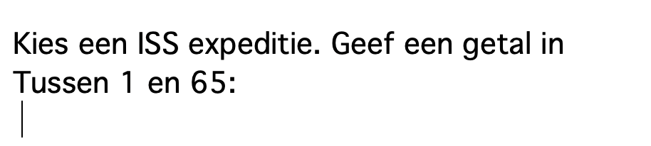

## Uitbreiden en testen - Gebruikersinteractie

Nu is het tijd om wat gebruikersinteractie toe te voegen aan jouw datavisualisatie!



--- task ---

Bekijk het [**ISS expeditieproject**](https://editor.raspberrypi.org/en/projects/data-iss-example){:target="_blank"} project. Er wordt aan de gebruiker gevraagd een ISS-expeditie te kiezen om te verkennen. De gebruiker voert een nummer in en vervolgens wordt dit nummer gebruikt om:
+ Relevante gegevens van die expeditie te op te zoeken
+ Teken vlaggen op het ISS op basis van de gegevens
+ De data die op deze expeditie van toepassing is te tonen als output aan de gebruiker

Zou je project iets dergelijks kunnen doen?

--- /task ---

--- task ---

Bekijk het [**UFO tracker**](https://editor.raspberrypi.org/en/projects/data-ufo-example){:target="_blank"} project. Met dit project kan de gebruiker op de verschillende vormen klikken die op de kaart worden weergegeven. Wanneer de gebruiker op een object klikt, wordt er een bericht weergegeven met het **type** van de UFO die op die locatie is gespot.

Kun je dit idee gebruiken om gebruikersinteractie aan jouw project toe te voegen?

--- /task ---

--- task ---

Verken het [**Kleine (toy) honden analyse**](https://editor.raspberrypi.org/en/projects/data-dogs-example){:target="_blank"} project. Hierbij wordt de gebruiker gevraagd te kiezen welk type gegevens in een grafiek wordt weergegeven.

Kunt je je gebruikers opties geven over het type gegevens dat zij willen zien?

Denk aan je eigen project en de data die je wilt dat je gebruikers kunnen verkennen. Laat je inspireren door de voorbeeldprojecten en bedenk hoe jouw gebruiker met het project zou kunnen omgaan.

--- /task ---

--- task ---

Gebruikersinteractie toevoegen aan jouw project. Hier is een herinnering aan enkele van de vaardigheden die je mogelijk nodig hebt om dit te doen:

--- collapse ---
---
title: Kies wat er gebeurt als op een bepaalde kleur wordt geklikt
---

Je kunt een `mouse_pressed()` functie maken om te werken met de `p5` bibliotheek. Hierdoor kan een taak worden uitgevoerd wanneer de muis wordt ingedrukt.

De onderstaande code haalt de hexadecimale kleur van de pixel op die met de muis is is aangeklikt:

--- code ---
---
language: python filename: main.py line_numbers: false line_number_start: 1
line_highlights:
---
pixel_colour = Color(get(mouse_x, mouse_y)).hex

--- /code ---

Dit stukje code kan worden gebruikt met een selectie-instructie (`if`) om iets te laten gebeuren op basis van de pixelkleur.

Een voorbeeld hiervan is te zien in het **UFO-waarnemingen** project:

--- code ---
---
language: python filename: main.py - mouse_pressed() line_numbers: false line_number_start:
line_highlights:
---
def mouse_pressed():

  # Display a message depending on what shape the user has pressed

    pixel_colour = Color(get(mouse_x, mouse_y)).hex
    if pixel_colour == fireball.hex:
        print('A fireball UFO was spotted here!')
    elif pixel_colour == circle.hex:
        print('A circle-shaped UFO was spotted here!')
    elif pixel_colour == tri.hex:
        print('A triangle-shaped UFO was spotted here!')
    elif pixel_colour == light.hex:
        print('A UFO made of light was spotted here!')
    elif pixel_colour == disc.hex:
        print('A disc-shaped UFO was spotted here!')
    elif pixel_colour == misc.hex:
        print('A random-shaped UFO was spotted here!')
    elif pixel_colour == cylinder.hex:
        print('A cylinder-shaped UFO was spotted here!')
    else:
        print('There were no UFO sightings in this area!')

--- /code ---

--- /collapse ---

--- collapse ---
---
title: Kies wat er gebeurt als op een specifiek gebied wordt geklikt
---
Om dit goed te laten werken, moet je ervoor zorgen dat elke pin een andere kleur heeft. Je moet er ook voor zorgen dat de kleur met behulp van een dictionary aan een regio is gekoppeld. Je zou je `kleuren` dictionary al moeten hebben ingevuld met code in de vorige stap.

Het voorbeeld hieronder toont de `kleuren` dictionary die wordt geraadpleegd is om feiten over de regio te tonen waarop met de muis is geklikt.

--- code ---
---
language: python filename: line_numbers: false line_number_start: 1
line_highlights:
---
def mouse_pressed():
# Put code to run when the mouse is pressed here

    pixel_colour = Color(get(mouse_x, mouse_y)).hex
    if pixel_colour in colours:
        facts = colours[pixel_colour]
        print('A volcano erupted in ' + facts['region'] + ' in ' + facts['year'])
    else:
        print('Region not detected')
--- /code ---

--- /collapse ---


--- collapse ---
---
title: Interactie op basis van gebruikersinvoer
---

Een goede manier om met je gebruiker te communiceren is door hem een vraag te stellen. Hun antwoord kan vervolgens in een variabele worden bewaard en worden gebruikt om de gevraagde gegevens weer te geven. Als je wilt dat je vraag wordt weergegeven voor een kaart, grafiek of tekening, dan moet je ervoor zorgen dat dit een van de eerste stukken code is die wordt uitgevoerd.

Veel voorkomende plaatsen om een gebruikersvraag te stellen:
+ In het hoofd(main)deel van je code (niet binnen een functie)
+ In een `main()` functie
+ In de `setup()` functie (als je `p5` gebruikt)

Hier is de code om een vraag te stellen; dit werd gebruikt in het **Happiness index project**:

--- code ---
---
language: python filename: main.py - main() line_numbers: false line_number_start: 1
line_highlights:
---
def main(): print('World Happiness Index Data 2019')

    choice = input('''What would you like to see?
        1. How happy are countries overall?
        2. How much does national wealth matter?
        3. How well does your country look after the disadvantaged?
        4. How generous are people?
        5. How fair and honest are people?
        6. How much freedom do you have?
    Choice: ''')

--- /code ---

--- /collapse ---

--- collapse ---
---
titel: Een while-lus gebruiken om vragen te herhalen
---

Je kunt een **while lus** gebruiken om een stukje code uit te voeren **terwijl** een **voorwaarde** gelijk is aan **Waar**. In het onderstaande voorbeeld blijft de lus lopen zolang de gebruiker **geen** `c` of `f` kiest. Dit is misschien handig om te gebruiken in je eigen project.

--- code ---
---
language: python filename: main.py line_numbers: false line_number_start:
line_highlights:
---
def menu(): choice = ''  # Start with a wrong answer for choice

    while choice != '1' and choice != '2':  # Keep asking the user for the right answer
        choice = input('Please enter 1 to encode/decode text, or 2 to perform frequency analysis: ')
    
    if choice == '1':
        do_something()
    
    elif choice == '2':
        do_something_else()

--- /code ---

--- /collapse ---

--- /task ---

--- task ---

**Test:** Voer je code uit en zorg ervoor dat deze doet wat je verwacht wanneer de gebruiker zijn keuze invoert. Als je programma meerdere opties heeft, zorg er dan voor dat je test dat **elke** optie werkt zoals verwacht.

Vraag ten slotte iemand anders om naar jouw programma te kijken en feedback te geven over het gebruikersinteractie-element.

--- /task ---

--- task ---

**Fouten opsporen:** Hieronder staan enkele potentiële fouten die kunnen optreden bij het werken met gebruikersinteractie:

--- collapse ---
---
title: De vraag wordt niet weergegeven wanneer het programma wordt uitgevoerd
---
Controleer of je vraag en `input()` functie zijn geplaatst in het juiste deel van je programma. Dit is meestal:
+ In het hoofd(main)deel van je code (niet binnen een functie)
+ In een `main()` functie
+ In de `setup()` functie (als je `p5` gebruikt)

--- /collapse ---

--- collapse ---
---
title: Er gebeurt niets als de gebruiker een getal invoert
---

De functie `input()` is ontworpen om alles wat een gebruiker typt aan te nemen en het te retourneren als **string**. Dit betekent dat je in je **condities**ook string waarden moet gebruiken. Je zou een conditie kunnen hebben die er als volgt uitziet:

```
if keuze == 1:
```
Dit controleert op de **numerieke** waarde: 1 en niet op de **string** waarde: 1. Om dit op te lossen, kun je apostrofs `'` aan beide kanten van je getal toevoegen.

```
if keuze == '1':
```

--- /collapse ---

--- collapse ---
---
title: De juiste data wordt niet weergegeven als ik met de muis klik
---

De functie `mouse_pressed()` die je hebt gemaakt is ontworpen om de **pixel kleur** te controleren waarop is geklikt. Als je twee of meer objecten hebt die dezelfde kleur hebben, dan zal het programma de gegevens weergeven voor de eerste voorwaarde in de volgorde die onwaar is.

Als je wilt dat jouw programma verschillende gegevens weergeeft voor elk item waarop de gebruiker klikt, dan moeten ze allemaal een **andere kleur**hebben. Je kunt hier een voorbeeld zien van hoe je dit kunt coderen voor al je data punten:

**Let op** dat de `kleuren` dictionary ook moet worden gedefinieerd in het hoofddeel van je code.

--- code ---
---
language: python filename: main.py - draw_data() line_numbers: false line_number_start: 1
line_highlights: 1, 6, 17-20
---
colours = {}

def draw_data():

    no_stroke()
    
    # Use the lat and long data to calculate the x y coords for the shape
    
    red = 255
    
    for eruption in volcano_eruptions:
        longitude = float(eruption['longitude'])
        latitude = float(eruption['latitude'])
        region_coords = get_xy_coords(longitude, latitude)
        region_x = region_coords['x']
        region_y = region_coords['y']
        colour = Color(red, 0, 0)
        colours[colour] = eruption
        draw_volcano(colour, region_x, region_y)
        red -= 2

--- /code ---

**Merk op dat** de kleur oorspronkelijk is ingesteld op `rood_waarde = 255`; dit is de hoogste hoeveelheid rood die je kunt gebruiken. Nadat elk gegevenspunt wordt getekend, wordt de waarde van `rood_waarde` verminderd met `1`. Dit zorgt ervoor dat elk datapunt een andere kleur heeft.

--- /collapse ---

--- /task ---


--- save ---
